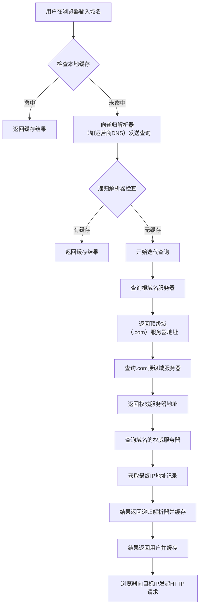

理解你对网络核心协议细节的探索欲望。DNS、IPv4 和 IPv6 是互联网的基石，掌握它们对理解整个网络世界至关重要。我会为你梳理这些关键协议的细节、区别和联系。

### 🌐 核心协议一览

下表汇总了 DNS、IPv4 和 IPv6 这三个核心协议的关键信息，帮你快速把握全貌。

| 特性维度 | DNS (域名系统) | IPv4 (互联网协议第4版) | IPv6 (互联网协议第6版) |
| :--- | :--- | :--- | :--- |
| **核心职能** | **域名解析** | **网络寻址** | **网络寻址** |
| **主要作用** | 将人类可读的**域名**转换为机器可识别的 **IP 地址** | 为网络中的设备分配**逻辑地址**，实现数据包的**路由和转发** | 解决IPv4地址耗尽问题，提供更大的地址空间及更多增强特性 |
| **地址示例** | `www.example.com` | `192.0.2.1` (32位) | `2001:0db8:85a3::8a2e:0370:7334` (128位) |
| **地址空间** | 不适用 | 约43亿个（32位） | 近乎无限（128位，约3.4×10³⁸个） |
| **传输协议** | 主要**UDP 53**，大响应或区域传输时用**TCP 53** | 在网络层运行，上层常用TCP、UDP等 | 在网络层运行，上层常用TCP、UDP等 |
| **关键特性** | 分布式、层次化、缓存机制 | 无连接、尽最大努力交付、支持NAT | 巨大地址空间、简化报头、原生支持IPsec、无状态地址自动配置 (SLAAC) |

---

### 🔍 DNS (域名系统)

DNS 是互联网的“电话簿”或“导航系统”，它负责将我们容易记住的域名（如 `www.google.com`）翻译成计算机用于通信的 IP 地址（如 `142.251.42.206`）。

#### **DNS 的工作原理与查询过程**

当你访问一个网站时，DNS 解析并非一蹴而就，它遵循一个精细的查询流程，其目标是尽可能**高效地**获取域名对应的 IP 地址。

#### **DNS 记录类型**

DNS 不仅能解析 IP，还通过不同类型的**资源记录 (Resource Records)** 承担多种职能：

| 记录类型 | 名称 | 功能描述 |
| :--- | :--- | :--- |
| **A** | Address | **最常用**，将域名指向一个 **IPv4 地址** |
| **AAAA** | | 将域名指向一个 **IPv6 地址** |
| **CNAME** | Canonical Name | **域名别名**。将域名指向另一个域名，再由另一个域名提供 IP 地址 |
| **MX** | Mail Exchange | 指定接收邮件的**邮件服务器**地址 |
| **NS** | Name Server | 指定该域名由哪个**权威 DNS 服务器**进行解析 |
| **TXT** | Text | 文本记录，常用于存储**验证信息**（如 SPF、DKIM）或其他备注数据 |

#### **DNS 安全与隐私**

传统的 DNS 查询是明文的，易被**劫持**（返回错误的IP）和**窃听**。为此出现了增强协议：
*   **DoH (DNS over HTTPS)**：通过 **HTTPS 协议**加密 DNS 查询，使用 **443 端口**，难以被审查和干扰。
*   **DoT (DNS over TLS)**：通过 **TLS 协议**加密 DNS 查询，使用 **853 端口**。
*   **DNSSEC**：并非加密查询内容，而是通过**数字签名**验证应答数据的**完整性和真实性**，防止DNS欺骗和缓存投毒。

---

### 📡 IPv4 与 IPv6

IP 协议负责在网络中唯一标识设备并引导数据包到达目的地。

#### **IPv4：传统的网络地址**

IPv4 地址是 **32 位**的二进制数，通常用点分十进制表示（如 `192.168.1.1`），总量约 **43 亿**个。为应对地址耗尽，主要采用了以下技术：
*   **NAT (网络地址转换)**：让多个设备共享一个公网 IPv4 地址。家庭路由器就是典型应用。
*   **私有地址段**：RFC 1918 规定了专供内网使用的地址范围，它们不能在公网上路由：
    *   `10.0.0.0` - `10.255.255.255` (10.0.0.0/8)
    *   `172.16.0.0` - `172.31.255.255` (172.16.0.0/12)
    *   `192.168.0.0` - `192.168.255.255` (192.168.0.0/16)
*   **特殊用途地址**：
    *   **回环地址**：`127.0.0.1`，表示设备自身。
    *   **链路本地地址**：`169.254.0.0/16`，当无法通过 DHCP 获取 IP 时自动分配。

#### **IPv6：下一代网络地址**

IPv6 采用 **128 位**地址，通常由 8 组 4 位十六进制数表示（如 `2001:0db8:85a3:0000:0000:8a2e:0370:7334`），可简写为 `2001:db8:85a3::8a2e:370:7334`。其主要优势包括：
*   **巨大的地址空间**：地址数量极其庞大，能为全球每一台设备分配唯一的地址。
*   **简化的报头**：固定 40 字节，去除了校验和字段，提高了路由器处理效率。
*   **原生安全性**：**IPsec** 成为 IPv6 的标配，可为网络层通信提供认证和加密，提升安全性。
*   **无状态地址自动配置**：设备可通过**邻居发现协议**获取网络前缀，并结合自身 **MAC 地址**生成全球唯一的 IPv6 地址，无需 DHCP 服务器。
*   **更好的移动性**：简化了设备在不同网络间切换时的流程。

IPv6 地址主要类型：
*   **单播地址**：标识一个唯一的接口。
*   **组播地址**：标识一组接口，向该地址发送数据包会被送达该组所有成员。IPv6 取消了 IPv4 中的**广播地址**，其功能由组播替代。
*   **任播地址**：标识一组接口，但数据包只会被送达**距离最近**（路由协议度量）的一个成员。

#### **IPv4 与 IPv6 的共存与过渡**

由于 IPv4 和 IPv6 不能直接通信，产生了多种过渡技术：
*   **双栈**：设备同时运行 IPv4 和 IPv6 协议栈，根据目标地址选择协议。
*   **隧道技术**：将 IPv6 数据包封装在 IPv4 数据包中穿越 IPv4 网络，如 **6to4**、**Teredo**。
*   **协议转换**：如 **NAT64**，允许 IPv6 网络的主机与 IPv4 网络的主机通信。

---

### 🛠️ 常用网络诊断命令

掌握一些命令有助于排查问题：

| 命令 | 功能描述 | 示例 |
| :--- | :--- | :--- |
| **`nslookup`** | 查询 DNS 记录 | `nslookup example.com` `nslookup -type=mx example.com` |
| **`dig`** | 更强大的 DNS 查询工具，显示详细过程 | `dig example.com` `dig +trace example.com` |
| **`ping`** | 测试与目标主机的网络连通性和延迟 | `ping 2001:db8::1` (IPv6) `ping example.com` (通过DNS解析) |
| **`ipconfig`** (Windows) | 显示当前网络配置（IP、网关、DNS等） | `ipconfig /all` |
| **`ifconfig`** (Linux/macOS) | 显示和配置网络接口参数 | `ifconfig` |
| **`tracert`** (Win) / **`traceroute`** (Linux/macOS) | 追踪数据包到达目标所经过的路由路径 | `tracert example.com` `traceroute6 example.com` (IPv6) |

希望以上梳理能帮助你更好地理解 DNS、IPv4 和 IPv6。这些知识是深入网络世界的基础。如果你对特定场景或更深入的技术细节有进一步疑问，我很乐意继续探讨。
