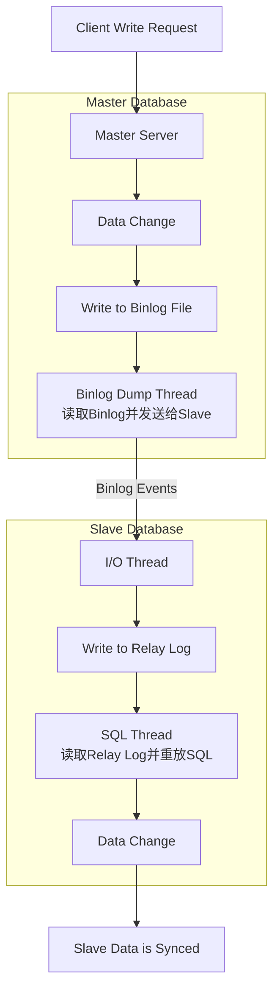

好的，我们来系统地探讨 MySQL 的高可用（High Availability, HA）方案，核心围绕**主从复制（Replication）**、**备份恢复**以及其底层核心 **二进制日志（Binlog）** 的原理。

这是一个三位一体的话题：Binlog 是实现主从同步的**基础**，主从复制是实现高可用和读写分离的**架构**，而备份则是数据安全的**最后防线**。

---

### 一、核心基石：二进制日志 (Binlog)

要理解主从复制，首先必须彻底理解 Binlog。

#### 1. 什么是 Binlog？
*   Binlog 是 MySQL Server 层维护的一种**二进制日志**，它**记录了对 MySQL 数据库执行的所有更改数据的 SQL 语句**（如 DDL、DML）或数据本身的变化。
*   它不像查询日志那样记录所有查询，只记录**引起数据变化的操作**。
*   **关键特性**：
    *   **追加写入**：以文件追加的方式写入，性能很高。
    *   **用于**：
        1.  **主从复制**：从库（Slave）通过读取主库（Master）的 Binlog 来重放数据变更，保持同步。
        2.  **数据恢复**：可以通过 Binlog 进行**基于时间点**的数据恢复。例如，某天中午12点误删了一张表，可以用前一天的全量备份 + 从前一天到12点前的 Binlog 进行恢复。

#### 2. Binlog 的三种格式
这是理解复制原理的关键，格式决定了 Binlog 里到底记录了什么东西。

| 格式 | 记录内容 | 优点 | 缺点 | 建议 |
| :--- | :--- | :--- | :--- | :--- |
| **STATEMENT (SBR)** | **记录原始的 SQL 语句**。 | 日志文件小，节省磁盘和网络 I/O。 | 可能产生**数据不一致**（如使用 `UUID()`, `NOW()` 等非确定性函数）。 | **已不推荐**。 |
| **ROW (RBR)** | **记录每一行数据如何被修改**（修改前/后的镜像）。 | **最安全**，能完全保证主从数据一致性。 | 日志文件大（例如一条 `UPDATE` 更新了100万行，RBR 会记录100万行变化）。 | **生产环境推荐默认格式**。 |
| **MIXED (MBR)** | **混合模式**。MySQL 自行判断哪些 SQL 使用 STATEMENT，哪些使用 ROW。 | 兼顾文件大小和一致性。 | 仍存在小概率风险。 | 过渡方案，不如直接使用 RBR。 |

**现代环境强烈推荐使用 `ROW` 格式**，因为数据一致性远比磁盘空间更重要。

---

### 二、高可用架构：主从复制 (Replication)

主从复制是 MySQL 最基础、最常用的高可用和负载均衡架构。

#### 1. 核心架构

*   **主库 (Master)**：负责处理应用的写操作（`INSERT`, `UPDATE`, `DELETE`），并将数据变更写入自己的 Binlog。
*   **从库 (Slave)**：负责复制主库的数据。它读取主库的 Binlog，然后在自身重放这些操作，保持与主库的数据一致。通常用于处理读操作（`SELECT`）。

#### 2. 复制原理与流程（基于 Binlog）

从库会启动两个线程来完成复制工作，其核心流程如下图所示：

1.  **主库 Binlog Dump 线程**：
    *   当主库的 Binlog 有更新时，主库会创建一个 `Binlog Dump Thread`。
    *   该线程负责读取 Binlog 中的事件，并将其发送给所有连接的从库。

2.  **从库 I/O 线程**：
    *   从库的 `I/O Thread` 负责与主库建立连接（使用授权的用户），请求 Binlog 更新。
    *   它接收主库 `Binlog Dump Thread` 发来的事件，并将其**写入到本地的中继日志（Relay Log）** 中。

3.  **从库 SQL 线程**：
    *   从库的 `SQL Thread` 负责读取本地的**中继日志（Relay Log）**。
    *   然后解析并执行其中的事件（SQL语句或行数据变更），将数据变更应用到从库中。

**为什么需要中继日志 (Relay Log)？**
主要是为了**解耦**。I/O 线程可以尽快地从主库拉取数据，写入本地文件（速度很快）；SQL 线程则可以相对缓慢地重放。如果没有 Relay Log，两个线程需要强同步，容易阻塞，降低效率。

#### 3. 主从复制的应用场景

1.  **读写分离**：主库写，从库读，显著提升系统整体读性能。这是最常见的用法。
2.  **数据备份**：从库本身就是一个实时备份（但注意：误操作删除数据也会被同步，所以不能替代传统备份）。
3.  **高可用基础**：主库宕机后，可以**手动**或**通过工具（如MHA, Orchestrator）自动**将一个从库提升为主库，继续提供服务。这是构建更高可用架构（如主从切换、双主）的基础。
4.  **数据分析**：在从库上执行耗时的统计、报表查询，避免影响主库的线上业务性能。

#### 4. 主从延迟问题

这是主从架构中最经典的问题。
*   **原因**：
    *   主库并发写入压力大，生成 Binlog 的速度快。
    *   从库 SQL 线程重放速度慢（可能是单线程的，5.6+ 支持并行复制但需要配置）。
    *   网络延迟。
    *   从库服务器性能较差。
*   **影响**：在从库上可能读不到刚在主库上写入的数据，造成业务逻辑错误。
*   **解决方案**：
    *   优化 SQL，减少慢查询。
    *   使用并行复制（`slave_parallel_workers`）。
    *   使用更强大的从库硬件（特别是更好的磁盘I/O）。
    *   业务层面强制某些必须读最新数据的请求走主库。

---

### 三、安全底线：备份与恢复

高可用解决的是服务不间断的问题，备份解决的是数据不丢失的问题。**没有备份，高可用毫无意义。**

#### 1. 备份类型

*   **物理备份 vs 逻辑备份**：
    *   **物理备份**：直接拷贝数据库的物理数据文件（如 `ibdata1`, `.ibd` 文件）。速度快，恢复快。工具：`Percona XtraBackup`（开源的物理热备工具）。
    *   **逻辑备份**：将数据库中的数据导出为 SQL 语句或文本格式。速度慢，恢复慢，但可读性强。工具：`mysqldump`。
*   **热备、温备、冷备**：
    *   **热备**：备份期间数据库读写不受影响。对业务最友好，技术要求高。`XtraBackup` 和商业版的 MySQL Enterprise Backup 支持。
    *   **温备**：备份期间数据库可读不可写。
    *   **冷备**：需要停止数据库服务进行备份。最简单，但停机时间长。

#### 2. 备份策略（全量 + 增量 + Binlog）

一个可靠的备份恢复方案必须是多层次的：

1.  **定期全量备份**：例如每周一次。使用 `XtraBackup` 或 `mysqldump` 进行完整的备份。
2.  **频繁增量备份**：例如每天一次。备份自上次全量备份以来的所有变化（`XtraBackup` 支持基于 LSN 的增量备份）。
3.  **实时 Binlog 备份**：**至关重要！** 定期（例如每小时）将 Binlog 文件备份到远程安全的地方。这是实现“基于时间点恢复”的关键。

#### 3. 恢复演练

**定期进行恢复演练**比备份本身更重要。你必须确保你的备份文件是有效的，并且你清楚地知道如何用它们来恢复数据库。一个无法恢复的备份等于没有备份。

### 总结：高可用架构全景图

一个生产级的 MySQL 高可用方案通常是这样的：

1.  **底层**：基于 **Binlog (ROW格式)** 搭建**主从复制**架构。
2.  **核心**：使用 **1 主 + 2 从（或多从）** 的集群模式。多个从库可以分担读负载，并为高可用提供冗余。
3.  **高可用**：使用**监控工具（如 Prometheus）** 和**自动故障转移工具（如 MHA, Orchestrator 或 InnoDB Cluster）**。当主库宕机时，工具能自动提升一个健康的新主库，并让其他从库和应用连接到新主库。
4.  **安全底线**：制定完善的**备份策略（全量+增量+Binlog）** 并**定期演练恢复流程**。
5.  **扩展**：在应用层使用中间件（如 ShardingSphere, MyCat）或客户端组件（如 `spring dynamic datasource`）来实现**读写分离**，自动将写请求发往主库，读请求发往从库。

通过这套组合拳，你就能构建出一个既高性能、高可用，又数据安全可靠的数据库服务。
