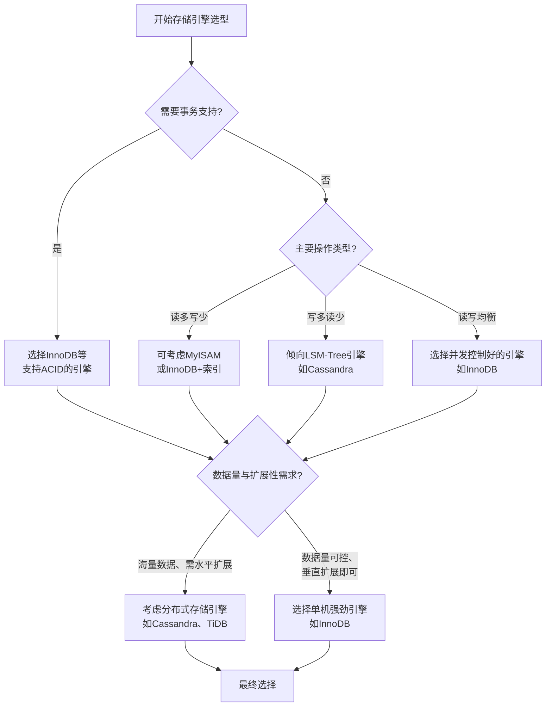

了解常见存储引擎及其实现机制和适用场景，对数据库设计和技术选型至关重要。下面我用一个表格汇总主流存储引擎的核心特性，然后为你解释它们的实现机制和典型应用场景。

| 存储引擎 | 数据模型/存储结构 | 索引结构 | 事务支持 | 锁机制 | 典型适用场景 |
| :--- | :--- | :--- | :--- | :--- | :--- |
| **InnoDB** | 行式存储，数据与索引存储在表空间（.ibd文件） | **B+Tree**（聚簇索引） | **ACID**、MVCC | **行级锁** | **OLTP**、高并发事务（电商、金融） |
| **MyISAM** | 非聚簇索引（.MYD数据文件 + .MYI索引文件分离） | **B+Tree** | 不支持 | **表级锁** | **读多写少**、数据仓库、静态内容管理 |
| **Memory** | 所有数据存储在**内存**中 | 默认**哈希索引**（也支持B树索引） | 不支持 | 表级锁 | **临时表**、**缓存**、会话存储 |
| **Archive** | 行式存储，**高压缩比** | 不支持（仅INSERT/SELECT） | 不支持 | 行级锁 | **日志归档**、**历史数据**存储 |
| **NDB Cluster** | 分布式存储，数据可存储在内存或磁盘 | | 支持 | 行级锁 | **高可用性**应用（电信、实时系统） |
| **WiredTiger** (MongoDB) | 文档存储（BSON） | B+Tree | 支持（4.0+） | 文档级锁 | **文档数据库**、高吞吐应用 |
| **SSTable** (Cassandra) | 分布式Key-Value，**LSM-Tree** | LSM-Tree | 最终一致性 | | **高写入吞吐**、海量数据（如IoT） |
| **内存存储** (Redis) | Key-Value、多种数据结构 | 哈希表 | 单命令原子性 | 单线程事件循环 | **缓存**、**实时计数**、消息队列 |

---

### 🧠 核心机制与选型考量

存储引擎是数据库管理系统的核心组件，负责数据的存储、检索、更新和管理。其设计选择深刻影响了数据库的性能、可靠性和功能。

1.  **存储与索引结构**：
    *   **B+Tree**：是许多关系型数据库（如MySQL InnoDB）的核心索引结构。其特点是**支持高效的范围查询和点查询**，适合读多写少的场景。
    *   **LSM-Tree**：一种**为高写入吞吐量优化**的结构，常用于NoSQL数据库（如Cassandra）。数据先写入内存（MemTable），再刷入磁盘（SSTable），并通过Compaction操作合并优化。**写性能极高，但读操作有时可能需要查询多个层次**。

2.  **事务与并发控制**：
    *   **ACID事务**：对于需要保证数据一致性和可靠性的应用（如银行交易）至关重要，InnoDB是典型代表。
    *   **锁机制**：
        *   **行级锁**（InnoDB）：**粒度小，允许多个事务同时操作不同行的数据，并发性能高**，适合高并发写入场景。
        *   **表级锁**（MyISAM）：**锁定整个表，写操作会阻塞其他所有读写操作**，并发性能较差，但开销小。
    *   **MVCC**：一种高级并发控制技术，通过维护数据的多个版本来实现**非阻塞读**，读写操作互不干扰，极大地提升了并发性能，InnoDB和PostgreSQL等都实现了MVCC。

3.  **持久化与恢复**：
    *   **WAL**：许多引擎（如InnoDB）使用**预写日志**来保证数据持久性。事务提交前，先将更改记录到日志（Redo Log）中，即使系统崩溃也能通过日志恢复数据。
    *   **检查点/快照**：定期将内存中的数据持久化到磁盘，如Redis的RDB。

---

### 🧭 如何选择合适的存储引擎

选择时，需综合考虑以下因素：

1.  **读写模式**：
    *   **读多写少**：MyISAM（但需注意其缺陷）、或使用InnoDB配合良好索引。
    *   **写多读少**：LSM-Tree系引擎（如Cassandra、RocksDB）。
    *   **读写都频繁**：InnoDB等支持行级锁和MVCC的引擎。

2.  **事务与一致性要求**：
    *   需要**强事务一致性**：**InnoDB**、PostgreSQL等。
    *   可以接受**最终一致性**：许多NoSQL数据库（如Cassandra）。

3.  **数据特性与访问模式**：
    *   **结构化数据**、复杂查询：关系型数据库引擎（InnoDB）。
    *   **半结构化数据**、灵活模式：文档型引擎（WiredTiger）。
    *   **临时数据、高速缓存**：Memory引擎、Redis。
    *   **海量历史数据归档**：Archive引擎。

4.  **并发与性能**：高并发写入选择支持行级锁或乐观锁的引擎。

5.  **可靠性要求**：关键业务系统需选择支持崩溃恢复（如InnoDB）或有完善持久化机制的引擎。

你可以遵循以下决策流程来帮助选型：

---

### 💎 总结

存储引擎是数据库的“心脏”，直接决定了数据的组织、访问和管理方式。
*   若需**事务安全和高并发读写**，**InnoDB** 是默认首选。
*   若主要是**只读或读多写少**，且可容忍表级锁和缺乏事务，可考虑 **MyISAM**。
*   若需**极高速访问且数据可丢失**，**Memory** 引擎适用于临时场景。
*   若需**归档大量历史数据**，**Archive** 引擎的高压缩比很适用。
*   若需处理**海量数据和高写入吞吐**，NoSQL的 **LSM-Tree** 系引擎（如Cassandra）更有优势。

没有万能的选择，最好的引擎取决于你的具体业务场景、数据模型以及性能需求。希望这些信息能帮助你做出更明智的技术选型。
