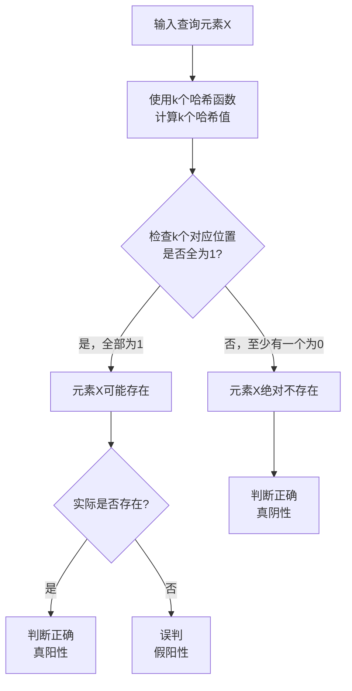

好的，我们来深入浅出地讲解 **布隆过滤器（Bloom Filter）**。它是一种非常巧妙的**概率型数据结构**，用于高效地判断一个元素**是否绝对不存在**或**可能存在**于一个集合中。

### 一、它解决了什么问题？

想象一个场景：你需要判断一个用户 ID 是否已经注册，或者一个网址是否已经被爬虫抓取过。
最直接的方法是：将所有已有的 ID 或 URL 存储在一个 HashSet 或数据库中。查询时，直接检查该元素是否在这个集合里。

**但这种方法有两个明显缺点：**
1.  **存储空间大**：如果集合非常大（例如数十亿个元素），需要占用大量的内存或磁盘空间。
2.  **查询速度慢**：在数据库或硬盘中查询，即使有索引，其速度也远慢于内存操作。

**布隆过滤器的价值就在于：** 它用极小的空间代价和极快的查询速度，告诉你“某样东西**肯定不存在**”或者“**可能存在**”。

---

### 二、核心思想与工作原理

布隆过滤器的核心是一个**二进制向量（位数组）** 和**一组哈希函数**。

#### 1. 加入元素 (Add)
当一个元素被加入布隆过滤器时，会进行以下操作：
1.  使用 `k` 个不同的哈希函数对这个元素计算，得到 `k` 个哈希值。
2.  将每个哈希值映射到位数组的某个位置，并将该位置的值设置为 `1`（在位数组中，初始所有位都是 `0`）。

#### 2. 查询元素 (Query)
当需要查询一个元素是否存在时，会进行以下操作：
1.  同样使用那 `k` 个哈希函数对元素计算，得到 `k` 个哈希值。
2.  检查这 `k` 个哈希值对应的位数组位置是否**全部**为 `1`。
    *   **如果其中有任意一个位置为 `0`**，那么这个元素**绝对不存在**于集合中。
    *   **如果所有位置都是 `1`**，那么这个元素**可能存在**于集合中。

#### 3. 为什么是“可能”存在？
因为存在**哈希冲突**。不同的元素经过哈希计算后，可能会映射到位数组的同一个或多个相同的位置。这会导致一种称为**误判（False Positive）** 的情况：即某个元素其实不在集合中，但布隆过滤器误报为存在。

**关键点：**
*   **布隆过滤器永远不会发生“假阴性”（False Negative）**。即如果它说某个元素不存在，那这个元素就一定不存在。这是它最可靠的性质。
*   **它只会发生“假阳性”（False Positive）**。即它说存在，但实际可能不存在。
*   **不支持删除操作**。因为将一个位置由 `1` 置为 `0` 可能会影响其他元素的判断。（但有一种变体叫**计数布隆过滤器（Counting Bloom Filter）**，它用计数器代替位，可以支持删除。）

为了让你更直观地理解布隆过滤器的工作原理和潜在的误判风险，我们可以看下面的流程图：



---

### 三、优缺点

| 优点 | 缺点 |
| :--- | :--- |
| **1. 空间效率极高**： 因为它只使用一个位数组，不存储元素本身。对于亿级数据，可能只需要几百MB内存。 | **1. 存在误判率**： 这是为节省空间所付出的代价。 |
| **2. 查询时间极快**： 查询时间都是常数时间 `O(k)`，与集合大小无关。 | **2. 不能删除元素**： 标准的布隆过滤器不支持删除操作。 |
| **3. 保密性好**： 不存储原始数据，只存储“特征”，一定程度上保护了隐私。 | **3. 无法获取元素本身**： 它只是一个“过滤器”，不能遍历或导出原始数据。 |

---

### 四、如何降低误判率？

误判率受三个因素影响：
1.  **位数组的长度 (`m`)**
2.  **哈希函数的数量 (`k`)**
3.  **需要存储的元素数量 (`n`)**

它们之间的关系有一个经验公式（其中 `p` 为误判率）：
$p \approx \left(1 - e^{-\frac{kn}{m}}\right)^k$

**设计原则：**
*   **位数组 `m` 越大**，误判率越低。
*   **哈希函数 `k` 的数量需要适中**。太少会导致冲突多，太多会导致位数组过快被填满，同样增加冲突。
*   通常可以根据预期的元素数量 `n` 和可接受的误判率 `p` 来计算出所需的位数组大小 `m` 和哈希函数个数 `k`。

**在线计算器：** 你可以搜索 "Bloom Filter Calculator"，通过输入 `n` 和 `p` 来得到推荐的 `m` 和 `k`。

---

### 五、应用场景

布隆过滤器通常用于**前置检查**，以减轻昂贵操作的压力。

1.  **缓存穿透 (Cache Penetration)**
    *   **问题**：黑客请求大量数据库中根本不存在的数据。这会导致请求绕过缓存，直接打到数据库，可能压垮数据库。
    *   **解决方案**：将所有可能存在的缓存键（如商品ID）放入布隆过滤器。在查询缓存之前，先查布隆过滤器。如果过滤器说 key 不存在，就直接返回空，避免了无效的数据库查询。

2.  **网页爬虫 (Web Crawler)**
    *   判断一个 URL 是否已经被抓取过。用布隆过滤器可以节省大量存储空间，即使有极小的误判（某个URL没抓但误判为抓了），对整体结果影响也不大。

3.  **垃圾邮件过滤**
    *   判断一封邮件的发件人是否在黑名单中。将所有黑名单邮件地址放入布隆过滤器。

4.  **数据库查询优化**
    *   在执行昂贵的 JOIN 或大表查询前，先用布隆过滤器快速判断某个键值是否存在，避免不必要的扫描。

5.  **分布式系统（如 Cassandra, HBase）**
    *   这些 NoSQL 数据库使用布隆过滤器来快速判断某个键是否存在于一个 SSTable 文件中，从而避免昂贵的磁盘 I/O 操作。

---

### 六、实际使用

在 Redis 4.0 及以上版本，官方提供了布隆过滤器的模块（`RedisBloom`），你可以直接使用。

**示例命令：**
```bash
# 创建一个名为 "myfilter" 的布隆过滤器，初始容量为 100000，误判率为 1%
BF.RESERVE myfilter 0.01 100000

# 向过滤器中添加元素
BF.ADD myfilter item1
BF.ADD myfilter item2

# 检查元素是否存在
BF.EXISTS myfilter item1 # 返回 1 (存在)
BF.EXISTS myfilter unknownitem # 返回 0 (肯定不存在)
```

**在 Go 语言中使用：**
可以使用第三方库如 `github.com/bits-and-blooms/bloom`。
```go
package main

import (
    "fmt"
    bloom "github.com/bits-and-blooms/bloom/v3"
)

func main() {
    // 创建一个可容纳 1000000 个元素，误判率为 0.01% 的布隆过滤器
    filter := bloom.NewWithEstimates(1000000, 0.01)

    // 添加元素
    filter.Add([]byte("hello"))
    filter.Add([]byte("world"))

    // 测试元素是否存在
    fmt.Println(filter.Test([]byte("hello"))) // true (可能存在)
    fmt.Println(filter.Test([]byte("golang"))) // false (绝对不存在)
}
```

### 总结

布隆过滤器是一种用**精确率换空间**的极致典范。它的核心价值在于：
*   **空间效率极高**，查询速度极快。
*   **判断“不存在”是100%准确的**，判断“存在”是有一定误判概率的。
*   非常适合用作**前置屏障**，防止大量无效请求穿透到后端昂贵的存储系统（如数据库）中去。

当你需要判断一个元素是否属于一个超大集合，并且可以接受小概率的误判时，布隆过滤器就是你最好的选择。
