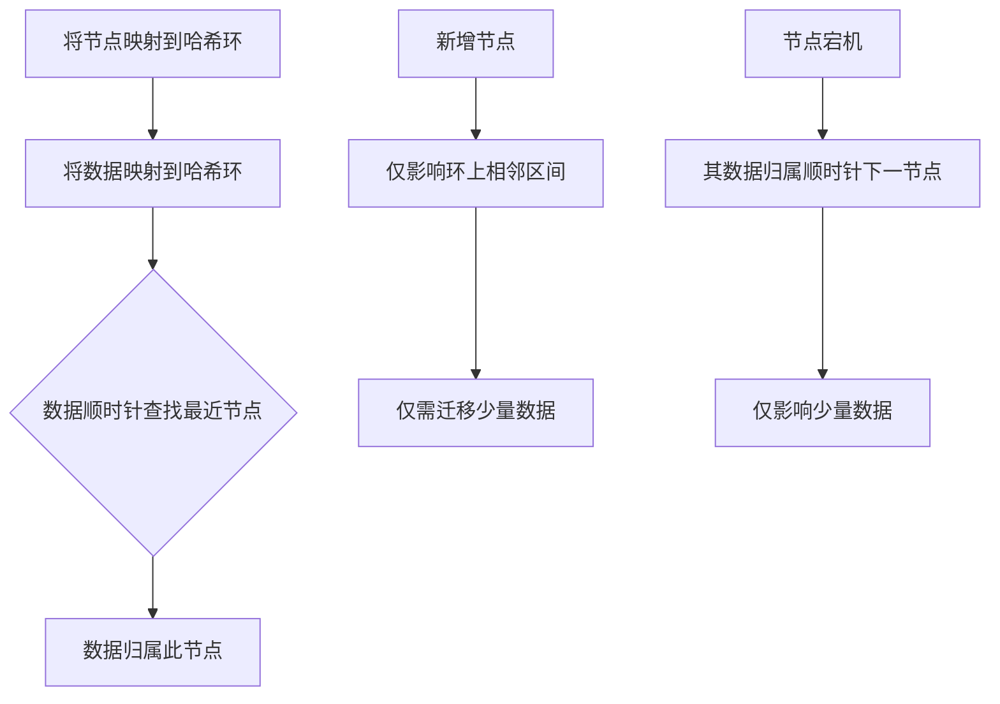

一致性哈希（Consistent Hashing）是一种特殊的哈希算法，1997年由麻省理工学院提出，主要用于分布式系统（如分布式缓存、负载均衡、数据库分片等），旨在解决节点动态增减时导致的大量数据重新映射问题，从而提升系统的可扩展性和稳定性。

为了让你快速了解其核心思想，我先用一个表格对比其与传统哈希的差异：

| 特性                 | 传统哈希算法 (如 hash(key) % N)                 | 一致性哈希算法                                                                 |
| :------------------- | :----------------------------------------------- | :----------------------------------------------------------------------------- |
| **数据迁移量**        | 节点变化时，**几乎全部数据**需要重新映射（约1-1/N） | 节点变化时，**仅局部数据**需要迁移（仅影响环上相邻节点）             |
| **负载均衡**          | 依赖哈希函数均匀性，节点数变化易导致不均衡                 | 通过**虚拟节点**机制，即使节点少也能实现较好均衡                         |
| **扩展性**          | 差，增减节点成本高                                 | **优秀**，支持动态平滑扩缩容                                           |
| **容错性**          | 节点宕机影响大量数据                                 | 节点宕机仅影响环上**相邻数据**，影响范围小                                 |
| **典型应用场景**      | 节点固定的简单应用                                 | **动态伸缩的分布式系统**（如Redis集群、负载均衡器、分布式数据库）                 |

---

### 🔍 工作原理

一致性哈希的核心是将节点和数据映射到一个**虚拟的哈希环**上，通常是一个 **0 到 2^32-1** 的环形空间。

其工作流程可以概括为以下几步：

1.  **构建哈希环**：创建一个范围为 0 到 2^32 - 1 的环形哈希空间。
2.  **节点映射**：使用哈希函数（如 CRC32、MD5 等）计算每个节点（通常基于其 IP 或主机名）的哈希值，并将其映射到环上的某个位置。
3.  **数据定位**：
    *   对要存储的数据键（Key）进行相同的哈希计算，得到其在环上的位置。
    *   从该位置开始，**沿环顺时针方向查找**，将数据存储或路由到遇到的**第一个节点**。

### ⚖️ 虚拟节点机制

当物理节点较少时，其哈希值在环上可能分布不均，导致**数据倾斜**（某个节点承担大量数据）。为解决此问题，引入了**虚拟节点**（Virtual Nodes）机制。

*   **原理**：为每个物理节点创建多个虚拟节点（例如，为物理节点 "NodeA" 创建 "NodeA#1"、"NodeA#2" ... "NodeA#1000"），并将这些虚拟节点映射到哈希环上。数据通过虚拟节点间接映射到物理节点。
*   **优势**：
    *   **提高负载均衡**：即使物理节点很少，大量虚拟节点也能使其在环上分布更均匀，数据分配也更均衡。
    *   **灵活分配权重**：可以通过为性能不同的物理节点分配不同数量的虚拟节点来实现加权负载均衡（性能好的节点多承担数据）。

### 🛠️ 应用场景

一致性哈希广泛应用于需要动态伸缩和负载均衡的分布式系统中：

1.  **分布式缓存**：如 **Redis Cluster**、**Memcached**。节点宕机或扩容时，仅少量缓存失效，避免雪崩。
2.  **负载均衡器**：如 **Nginx**。将请求按特定键（如用户IP或会话ID）可靠地路由到固定的后端服务器，支持上游服务器动态变化。
3.  **分布式数据库/存储**：如 **Cassandra**、**Amazon DynamoDB**。用于数据分片，确定数据存储的物理节点。
4.  **P2P 网络**：用于高效定位资源所在的节点。

### 💡 实现简述

以下是在许多系统中实现一致性哈希的关键步骤：
1.  **选择哈希函数**：选择一个分布均匀的哈希函数（如 CRC32、MD5、SHA1）。
2.  **维护哈希环**：通常使用**有序数据结构**（如红黑树或跳表）存储虚拟节点及其哈希值，以便高效进行顺时针查找。
3.  **虚拟节点管理**：为每个物理节点生成大量虚拟节点（例如数百甚至上千个），并将其哈希值存入哈希环。
4.  **数据查找**：计算数据的哈希值，在环中查找第一个大于等于该哈希值的虚拟节点，从而找到对应的物理节点。

### ⚠️ 注意事项

1.  **虚拟节点数量**：虚拟节点越多，分布越均匀，但维护开销也会略微增加。需在均衡性和性能间权衡。
2.  **哈希函数选择**：应选择**分布均匀**且**碰撞率低**的哈希函数，以避免天然的数据倾斜。
3.  **数据迁移**：尽管迁移量已大幅减少，但在节点变化时，仍需实现高效的数据迁移和同步机制。

### 💎 总结

一致性哈希通过**哈希环**和**虚拟节点**的巧妙设计，优雅地解决了分布式系统中节点动态变化带来的数据大规模迁移和负载均衡问题。其核心优势在于：
*   **平滑扩缩容**：增减节点仅影响环上相邻部分数据，迁移量小。
*   **良好负载均衡**：通过虚拟节点使数据分布更均匀，避免热点。
*   **高容错性**：节点故障影响范围有限。

这使得它成为构建弹性、可扩展分布式系统的基石算法之一。

希望以上信息能帮助你理解一致性哈希。如果你对特定场景的应用或技术细节有更多疑问，我很乐意继续探讨。
