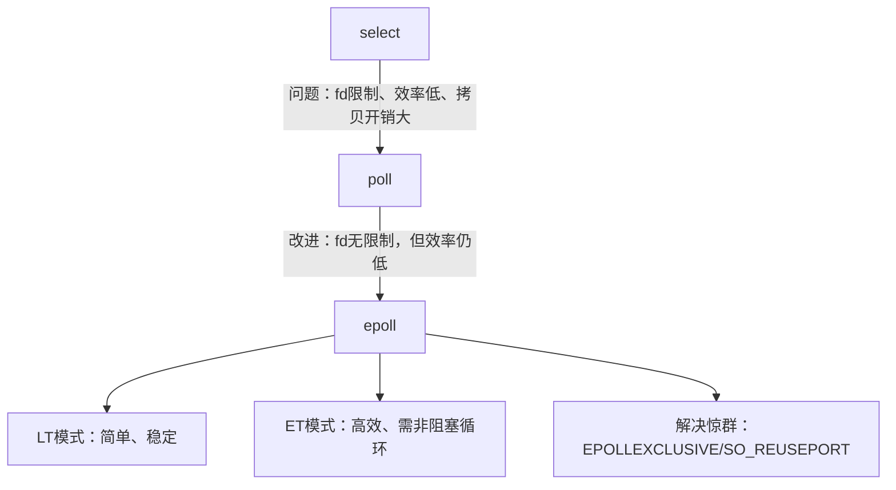

好的，我们来深入探讨 Linux I/O 多路复用中的关键概念：`epoll` 的两种触发模式（LT/ET）、`select/poll` 的对比，以及惊群问题（Thundering Herd Problem）。

---

### 一、`epoll` 的两种触发模式：LT 与 ET

`epoll` 是 Linux 下高性能 I/O 多路复用的核心机制，它提供了两种工作模式：**水平触发（Level-Triggered, LT）** 和 **边缘触发（Edge-Triggered, ET）**。

| 特性 | 水平触发 (LT) | 边缘触发 (ET) |
| :--- | :--- | :--- |
| **触发条件** | 只要文件描述符处于**就绪状态**（如读缓冲区有数据），就会**持续触发**事件通知。 | 只有当文件描述符状态**发生变化**时（如从无数据变为有数据），才会触发**一次**事件通知。 |
| **工作方式** | 像“水平仪”，只要条件满足（水位高于阈值），就一直提醒你。 | 像“边缘检测器”，只在状态跳变（从0到1）时提醒一次。 |
| **事件处理** | 一次没处理完，下次 `epoll_wait` 会再次通知。 | 必须一次性处理完所有可用数据，否则剩余数据不会触发新事件（除非有新数据到来导致状态再次变化）。 |
| **编程复杂度** | **简单**。适合初学者，容错性高。 | **复杂**。需要更精细的控制，必须使用非阻塞 I/O 并循环读取/写入直到 `EAGAIN`。 |
| **性能** | 可能产生**多余的系统调用**（如果数据没处理完，会重复通知）。 | **更高效**。减少不必要的唤醒，尤其在高并发时性能更优。 |
| **适用场景** | 常规应用，对性能要求不极致。 | 高性能服务器（如 Nginx），追求极限吞吐量。 |

#### 核心区别示例（读事件）

*   **LT 模式**：
    1.  客户端发送 100KB 数据。
    2.  `epoll_wait` 返回，通知可读。
    3.  服务器只读取了 50KB。
    4.  下次调用 `epoll_wait` 时，**会再次立即返回**，通知还有 50KB 可读。

*   **ET 模式**：
    1.  客户端发送 100KB 数据（状态从无到有，触发通知）。
    2.  `epoll_wait` 返回，通知可读。
    3.  服务器必须用**循环**读取，直到 `read` 返回 `-1` 且 `errno = EAGAIN`（表示暂时无数据），确保读完 100KB。
    4.  如果只读了 50KB 就停止，剩下的 50KB **不会触发新的事件**，即使它们还在缓冲区里！除非客户端**再次发送新数据**（导致状态再次变化）。

**ET 模式必须使用非阻塞 I/O！** 否则，如果最后一次 `read` 时数据不够，会导致阻塞。

---

### 二、`select` / `poll` / `epoll` 对比

这三种都是 Linux 提供的 I/O 多路复用机制，用于同时监控多个文件描述符（fd）的状态（可读、可写、异常）。

| 特性 | `select` | `poll` | `epoll` |
| :--- | :--- | :--- | :--- |
| **跨平台** | 几乎所有平台 | 大多数 Unix-like | **Linux 特有** |
| **fd 数量限制** | 有（`FD_SETSIZE`，通常 1024） | **无硬性限制** | **无硬性限制** |
| **fd 集合传递方式** | 每次调用需传入**整个 fd_set**（读、写、异常三组） | 每次调用需传入**整个 pollfd 数组** | **内核维护事件表**，通过 `epoll_ctl` 增删改 fd |
| **工作模式** | 仅支持 **LT** | 仅支持 **LT** | 支持 **LT 和 ET** |
| **效率** | O(n) 线性扫描所有 fd | O(n) 线性扫描所有 fd | O(1) **事件驱动**，只返回就绪的 fd |
| **内核实现** | 轮询 | 轮询 | **回调 + 就绪队列** |
| **性能（fd 多且活跃少）** | 差 | 差 | **极优** |
| **内存拷贝开销** | 每次调用需**从用户态拷贝 fd_set 到内核态** | 每次调用需**从用户态拷贝 pollfd 数组到内核态** | 仅 `epoll_ctl` 修改时需拷贝，`epoll_wait` **仅从内核拷贝就绪事件到用户态** |
| **适用场景** | 低并发、跨平台需求 | 比 `select` 稍好，fd 数较多时 | **高并发、高性能网络服务器** |

**总结**：`epoll` 在性能和可扩展性上全面优于 `select` 和 `poll`，是现代 Linux 高性能网络程序的首选。`select` 和 `poll` 仅用于兼容性或 fd 数量极少的场景。

---

### 三、惊群问题 (Thundering Herd Problem)

#### 1. 什么是惊群问题？

*   **定义**：当**多个进程（或线程）** 在**同一个 I/O 多路复用调用**（如 `accept`, `select`, `poll`, `epoll_wait`）上阻塞等待时，如果有一个**新事件**（如一个新的 TCP 连接到达），操作系统会**唤醒所有等待的进程/线程**，但最终**只有一个**能成功处理该事件（如 `accept` 到这个连接），其他被唤醒的进程/线程发现无事可做，又白白地切换回睡眠状态。
*   **后果**：造成**大量不必要的上下文切换**和**CPU资源浪费**，严重降低系统性能，尤其是在高并发时。

#### 2. 哪些场景会发生惊群？

*   **`accept` 惊群**（经典问题）：
    *   多个进程/线程在同一个监听套接字上调用 `accept()` 阻塞等待。
    *   一个新连接到达，内核唤醒所有阻塞在 `accept()` 上的进程/线程。
    *   只有一个进程/线程能成功 `accept()` 到这个连接，其他进程/线程的 `accept()` 调用会失败（返回 `EAGAIN` 或 `EWOULDBLOCK`，如果是非阻塞套接字），或者被唤醒后发现无连接可接受（阻塞套接字可能再次阻塞）。

*   **`epoll_wait` / `select` / `poll` 惊群**：
    *   多个进程/线程在同一个 `epoll` 实例（或其他多路复用器）上调用 `epoll_wait()` 等待事件。
    *   一个事件（如监听套接字可读）发生，内核唤醒所有等待的进程/线程。
    *   只有一个进程/线程能成功 `accept()` 到这个连接，其他被唤醒的进程/线程发现事件已被处理，白白浪费一次唤醒。

#### 3. 如何解决惊群问题？

| 解决方案 | 描述 | 适用场景 | 优点 | 缺点 |
| :--- | :--- | :--- | :--- | :--- |
| **互斥锁 (锁在用户态)** | 在调用 `accept()` 或 `epoll_wait()` 前，先获取一个**全局锁**。只有拿到锁的进程/线程才能进入等待。事件到来时，只有持有锁的进程/线程被唤醒（或只有一个能抢到锁去处理）。 | 多进程/多线程模型 | 实现相对简单，通用性强。 | 锁竞争可能成为瓶颈；需要额外同步机制。 |
| **`SO_REUSEPORT` 套接字选项 (Linux 3.9+)** | 允许多个进程/线程**绑定到同一个IP地址和端口**。内核负责将**新连接均匀分发**给不同的监听套接字（及其背后的进程/线程）。 | 多进程模型 | **从根源解决** `accept` 惊群；负载均衡；无需用户态锁。 | 需要较新内核；进程独立监听，状态不共享（如连接计数）。 |
| **`EPOLLEXCLUSIVE` 标志 (Linux 4.5+)** | 在 `epoll_ctl(EPOLL_CTL_ADD)` 时使用 `EPOLLEXCLUSIVE` 标志。当事件发生时，内核**只会唤醒一个正在 `epoll_wait` 的进程/线程**（而不是全部）。 | `epoll` 多进程模型 | 解决 `epoll_wait` 惊群；使用简单。 | 需要较新内核（4.5+）；只对 `epoll` 有效。 |
| **单进程监听 + 分发** | 只让**一个专门的进程**负责监听端口和 `accept()` 新连接。然后将接收到的连接通过 **IPC（如管道、Unix域套接字）** 分发给其他工作进程处理。 | 多进程模型 | 彻底避免惊群；架构清晰。 | 增加复杂度；分发可能成为瓶颈；需要进程间通信。 |

**现代最佳实践**：
*   对于 **`accept` 惊群**：优先使用 **`SO_REUSEPORT`**。
*   对于 **`epoll_wait` 惊群**：使用 **`EPOLLEXCLUSIVE`** 标志（如果内核支持）。
*   如果内核较旧或不支持上述特性：使用**用户态锁**保护 `accept()` 或 `epoll_wait()` 的入口。

---

### 四、总结图：从 `select/poll` 到 `epoll` 的演进

**核心结论：**
1.  **`epoll` 是 Linux 高性能网络编程的基石**，远胜于 `select/poll`。
2.  **LT 模式** 易用安全，适合大多数场景；**ET 模式** 性能更高，但编程复杂，需配合非阻塞 I/O 和循环读写。
3.  **惊群问题** 是高并发服务器的潜在性能杀手，可通过 `SO_REUSEPORT`、`EPOLLEXCLUSIVE` 或用户态锁有效解决。
4.  理解这些机制的区别和适用场景，是构建稳定、高性能网络服务的关键。
