好的，我们来深入探讨文件系统的两个核心概念：**文件的逻辑结构**（用户视角）和**目录的实现**（系统视角）。

### 一、文件的逻辑结构 (Logical File Structure)

文件的逻辑结构是从**用户角度**看到的文件的组织形式，它定义了信息在文件内部是如何排列和被访问的。操作系统提供了一系列系统调用（如 `read`, `write`, `seek`）来操作这些结构。

主要分为两大类：

#### 1. 无结构文件（字节流文件）

*   **定义**：文件被看作是一个**无结构的、连续的字节序列**。文件内部的信息不再被划分成更小的逻辑单位。
*   **特点**：
    *   **极大的灵活性**：用户程序可以自定义任何含义和格式（例如，文本文件、可执行文件、JPEG图片文件，其结构含义由应用程序解释）。
    *   **简化管理**：操作系统无需理解文件内容，只需管理字节的读写。
*   **现代应用**：**这是现代操作系统（如 Unix/Linux, Windows）中最主流、最常见的文件类型**。我们平时创建的 `.txt`, `.c`, `.py`, `.mp4` 文件都属于此类。

#### 2. 有结构文件（记录式文件）

*   **定义**：文件由一组**相似的记录**组成，每条记录又包含若干个**数据项（字段）**。可以想象成一张数据库表。
*   **分类**：
    *   **顺序文件**：记录按某种顺序（通常是主键）连续存储。要查找第N条记录，必须从头开始顺序读取前N-1条记录。批量处理高效，但随机访问性能差。
    *   **索引文件**：为加快检索速度，建立一张**索引表**。索引表本身是一个顺序文件，每条索引记录包含一个**键**和指向主文件中对应记录的**指针**。先快速在索引表中查找（可二分查找），再通过指针直接访问记录。**优点**：大大提高了随机访问的速度。**缺点**：需要额外的存储空间存放索引表。
    *   **索引顺序文件**：顺序文件和索引文件的折中。先将记录分组，只为每一组的第一个记录建立索引项。查找时，先通过索引定位到大致分组，再在该分组内进行顺序查找。平衡了索引开销和查询性能。
    *   **直接文件（哈希文件）**：通过**哈希函数**直接将记录的键转换为文件中的物理地址。**优点**：访问速度极快（理想情况下时间复杂度为O(1)）。**缺点**：冲突处理复杂，不适合范围查询。

**总结对比：**

| 逻辑结构类型 | 核心思想 | 优点 | 缺点 | 典型应用 |
| :--- | :--- | :--- | :--- | :--- |
| **无结构（字节流）** | 视为字节序列 | 灵活、通用、实现简单 | 含义由应用程序解析 | **绝大多数现代文件**（.txt, .exe, .mp4） |
| **有结构（顺序文件）** | 记录顺序排列 | 批量处理效率高 | 随机访问性能差 | 历史遗留系统、日志文件 |
| **有结构（索引文件）** | 用索引表加速查询 | 随机访问速度快 | 占用额外空间维护索引 | 数据库系统 |
| **有结构（哈希文件）** | 用哈希函数直接定位 | 访问速度极快（O(1)） | 冲突处理复杂，不支持范围查询 | 键值存储（如 Berkeley DB） |

---

### 二、目录的实现

目录的实现是从**操作系统角度**来看如何管理文件的元数据，并快速定位文件数据本身。其核心是**目录项**的设计和组织。

#### 1. 目录的本质

用户看来，目录是包含文件和子目录的容器。但在操作系统看来：
*   **目录本身就是一个特殊的文件**。
*   这个特殊文件的内容不是用户数据，而是一系列 **目录项**。
*   每个**目录项**记录了该目录下一个文件（或子目录）的**名字**以及如何找到其元数据（如 inode 编号）。

#### 2. 目录项的内容

一个目录项至少包含两个最基本的信息：
1.  **文件名**：文件或子目录的名称。
2.  **索引节点号 (inode number)**：指向文件元数据（**inode**）的指针。文件的所有元信息（权限、大小、时间戳、数据块指针等）都存储在 inode 中，而不是目录项里。

**这种设计的巨大优势**：
*   **实现硬链接**：多个不同的目录项可以指向同一个 inode，从而实现一个文件有多个名字（硬链接）。
*   **便于文件移动和重命名**：在同一个文件系统内移动文件，只是改变目录项的内容（inode 编号和名称），而不需要移动文件数据本身，速度极快。

#### 3. 目录文件的内部组织方式

目录文件的内容（即所有目录项的集合）如何存储，主要有两种实现方式：

| 实现方式 | 工作原理 | 优点 | 缺点 |
| :--- | :--- | :--- | :--- |
| **线性列表** | 目录文件就是一个简单的线性列表，每个条目包含 `[inode编号, 文件名]`。 | **实现简单**。 | **查找效率低**。查找一个文件需要线性扫描整个列表。**删除文件**后会产生**空洞**，需要压缩或标记空闲。 |
| **哈希表** | 目录文件组织成一个哈希表。文件名经过哈希函数计算后，直接得到该目录项在目录文件中的位置。 | **查找速度极快**，理想情况下接近 O(1)。 | **需要处理哈希冲突**（如链地址法）。**固定大小的哈希表**在文件数量激增时性能会下降。 |

**现代系统通常采用改进的线性列表**：
*   因为目录项数量通常不多，线性扫描的开销可以接受。
*   读取目录后会缓存到内存中，加速后续查找。
*   例如，Linux 的 `ext4` 文件系统引入了 **HTree** 目录索引，实际上是一种高效的树形结构，来加速大型目录的查找。

---

### 三、逻辑结构与目录实现的关联

理解这两个概念如何协同工作至关重要，其核心交互过程如下图所示，它完整展示了从用户请求到数据获取的完整路径：

```mermaid
flowchart TD
A[用户请求<br>open'/docs/report.txt'] --> B[文件系统遍历路径]

subgraph B[路径遍历]
    B1[根目录 &#40;&#47;&#41;] -- 查找'docs' --> B2[docs 目录]
    B2 -- 查找'report.txt' --> B3[找到report.txt目录项]
end

B3 --> C[获取inode编号]
C --> D[在inode表中<br>找到对应inode]

subgraph E[inode元数据]
    D --> F[权限<br>大小<br>时间戳等]
    D --> G[数据块指针]
end

G --> H[根据指针访问数据块]
H --> I[将文件内容<br>作为字节流读入内存]
I --> J[应用程序解释字节流逻辑结构]

subgraph K[逻辑结构类型]
    J --> L[无结构<br>（如文本文件，由文本编辑器解释）]
    J --> M[有结构<br>（如数据库文件，由DBMS解释）]
end
```

这个过程揭示了几个关键点：
1.  **职责分离**：目录和inode负责**物理定位**（文件数据块在哪），而应用程序负责**逻辑解析**（数据块里的字节是什么含义）。
2.  **性能核心**：目录的实现方式（线性列表 vs 哈希表）直接影响了根据文件名查找inode的速度。
3.  **灵活性来源**：将文件视为**字节流**，使得操作系统无需关心内容格式，从而可以支持无限多种文件类型。

希望这个详细的解释和图示能帮助你彻底理解文件逻辑结构和目录实现之间的关系。
