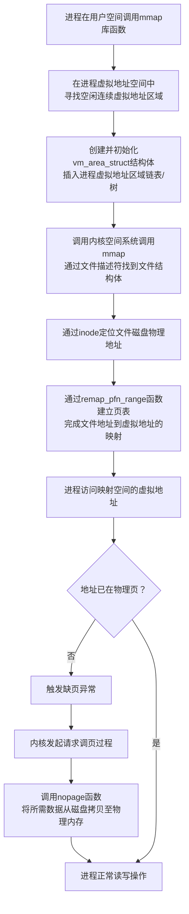
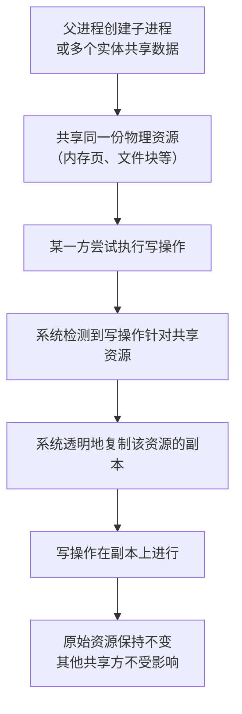

内存映射（mmap）和写时复制（Copy-on-Write, COW）都是现代操作系统中用于高效管理内存和文件的重要机制。它们通过巧妙的“延迟”和“共享”策略来优化性能和资源利用。下面我将为你解释它们的原理、工作流程以及应用场景。

### 📖 内存映射 (mmap)

**内存映射 (mmap)** 是一种将文件或设备直接映射到进程虚拟地址空间的技术。映射后，进程可以像访问普通内存一样读写文件内容，无需频繁调用 `read` 或 `write` 等系统调用。

#### **mmap 的工作原理与过程**
mmap 的实现过程可以分为三个阶段，其核心是**建立文件地址与进程虚拟地址的映射关系，而非立即加载数据**：

#### **mmap 的优势与特点**
*   **减少数据拷贝**：传统 `read`/`write` 需要进行 2 次数据拷贝（内核缓冲区到用户缓冲区），而 `mmap` 只需要 1 次（磁盘到内核缓冲区），避免了内核空间到用户空间的数据拷贝，提高了大文件操作的效率。
*   **惰性加载**：`mmap` 在建立映射时并不会立即将文件所有内容加载到内存中。它采用**按需加载**的策略，只有在实际访问到某块数据时，才会通过**缺页异常**将其从磁盘加载到物理内存。这使得它可以处理远大于物理内存的文件。
*   **共享内存**：多个进程可以映射同一个文件，从而实现共享内存通信（IPC），内核会确保共享数据的可见性和一致性。

#### **mmap 的注意事项与适用场景**
*   **适用场景**：
    *   处理**大文件**的随机访问。
    *   需要实现**进程间共享内存** (IPC)。
    *   多个进程**只读**访问同一文件（如共享库）。
*   **注意事项**：
    *   **不适合小文件**：对于小文件，`mmap` 的建立和销毁开销可能超过其带来的好处。
    *   **频繁随机写入**：可能导致大量的**脏页回写**，产生随机 I/O，性能可能反而不如传统方式。
    *   **映射大小固定**：映射建立时就需要指定大小，不适合频繁增长的文件。
    *   **数据一致性**：虽然内核会负责脏页回写，但仍有延迟。需要强制同步时，应调用 `msync()`。

---

### 📖 写时复制 (Copy-on-Write, COW)

**写时复制 (Copy-On-Write)** 是一种资源管理策略，其核心思想是**只有在真正需要写入（修改）数据时，才进行数据复制**。在此之前，所有使用者共享同一份数据副本。

#### **COW 的工作原理与过程**
COW 的工作流程围绕“共享-检测-复制”展开，其核心是在修改操作时触发复制，而非在创建时就复制全部数据：

#### **COW 的优势与特点**
*   **资源高效**：极大减少了不必要的复制操作，**节省内存和存储空间**。
*   **提升性能**：**加速创建过程**（如 `fork()` 瞬间完成），读操作无额外开销，特别适合**读多写少**的场景。
*   **实现快速快照**：在文件系统（如 ZFS, Btrfs）和数据库中，可以快速创建快照，仅当数据修改时才分配新空间。

#### **COW 的注意事项与适用场景**
*   **适用场景**：
    *   **进程创建**：Linux 的 `fork()` 系统调用。
    *   **文件系统快照**：ZFS、Btrfs 等。
    *   **版本控制系统**：如 Git 管理文件版本。
    *   **编程语言容器**：如 Java 的 `CopyOnWriteArrayList`。
*   **注意事项**：
    *   **写操作开销**：**首次写入特定数据时会带来复制开销**，如果后续写操作频繁，性能可能下降。
    *   **实现复杂度**：需要操作系统和应用程序协同跟踪共享状态，管理复制逻辑，增加了系统设计的复杂性。
    *   **数据一致性**：在某些实现中（如 Java 的 CopyOnWrite 容器），只能保证**最终一致性**，不能保证实时一致性。这意味着一个线程写入后，其他线程可能无法立即读到最新值。

---

### 💎 总结与协同

内存映射（mmap）和写时复制（COW）都是通过“共享”和“延迟”策略来提升系统效率和性能的杰出设计。

*   **mmap** 的核心是**映射**，它延迟了数据的**加载时机**（按需加载），并通过共享同一份物理内存页来减少数据拷贝，优化了文件 I/O 和进程通信。
*   **COW** 的核心是**复制**，它延迟了数据的**复制时机**（写时复制），通过共享来节省资源，并加速了创建过程，优化了进程创建和资源管理。

在实际系统中，这两者经常协同工作。一个典型的例子就是 **Linux 创建子进程**：
1.  父进程通过 `fork()` 创建子进程，此时使用 **COW** 技术，子进程与父进程共享所有的物理内存页。
2.  如果父进程或子进程需要修改某块内存，COW 会为该进程复制一个专用的物理页。
3.  如果这块内存是通过 **mmap** 映射的文件区域，那么修改后的脏页最终又会被内核通过 mmap 机制写回磁盘。

希望以上解释能帮助你更好地理解内存映射和写时复制。如果你对特定场景或更深入的技术细节有更多疑问，我很乐意继续探讨。
