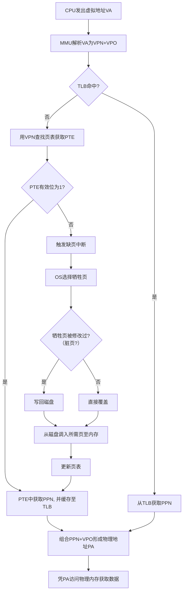

虚拟内存是操作系统内存管理的一项核心技🖥️，它通过软硬件结合的方式，让每个进程都认为自己拥有一个连续、独立且容量很大的内存空间，从而更高效、安全地使用物理内存。下面我将通过一个表格快速了解其核心概览，然后详细解释其工作原理和细节。

| 核心方面 | 简要说明 |
| :--- | :--- |
| **核心思想** | 为每个进程提供一个**独立、连续**的虚拟地址空间，并将其映射到**零散**的物理内存与磁盘空间中。 |
| **主要目的** | 1. **扩展地址空间**：运行比物理内存更大的程序。 2. **内存保护与隔离**：防止进程间相互干扰。 3. **简化编程**：程序员无需关心物理内存的实际分配。 |
| **关键硬件** | **内存管理单元 (MMU)**：负责**虚拟地址**到**物理地址**的转换。 |
| **核心机制** | **分页机制**：将虚拟和物理空间划分为固定大小的**页**，并通过**页表**管理映射关系。当访问的页不在物理内存时，触发**缺页中断**，由操作系统从磁盘**调入**。 |
| **磁盘缓存** | **交换空间 (Swap Space)**：在磁盘上开辟的区域（Windows为`Pagefile.sys`，Linux为`Swap分区`），用于换出暂不使用的内存页。 |
| **主要优点** | 1. 让程序使用比物理内存更大的空间。 2. 提高多任务能力、内存利用率和安全性。 3. 简化软件开发。 |
| **主要缺点** | 1. **性能开销**：地址转换和可能的磁盘I/O会带来延迟。 2. **管理开销**：页表等数据结构占用额外内存。 |

---

### 🔍 虚拟内存如何工作

虚拟内存的工作流程涉及多个关键步骤和组件的协同，其核心是**按需调页**和**地址转换**。

1.  **CPU生成虚拟地址**：程序中的所有内存地址都是**虚拟地址**。
2.  **MMU解析与TLB查询**：CPU将虚拟地址交给**MMU**。MMU将其分解为**虚拟页号（VPN）** 和**页内偏移（VPO）**。MMU首先查询**TLB**（快表，页表的高速缓存）来尝试获取对应的**物理页号（PPN）**。
3.  **页表查询与缺页中断**：
    *   若TLB**未命中**，MMU则用VPN作为索引去查找进程的**页表**，找到对应的**页表项（PTE）**。
    *   PTE中的**有效位**指示该页是否已在物理内存中。
    *   若有效位为 **0**（**缺页**），CPU会触发一个**缺页中断**，操作系统内核被调用。
4.  **处理缺页中断**：操作系统执行以下操作：
    *   检查目标地址是否合法。
    *   在物理内存中找到一个**空闲页框**。若没有空闲页框，则调用**页面置换算法**（如LRU）选择一个**牺牲页**将其换出。
    *   如果牺牲页在被调入后**被修改过**（是**脏页**），则需要将其**写回磁盘**，否则直接覆盖。
    *   将**所需的页面从磁盘（交换空间）调入**物理内存的空闲页框中。
    *   **更新页表**，设置有效位为1，并填入对应的PPN。
5.  **地址转换与数据访问**：
    *   一旦PTE有效（无论是在TLB中找到还是经过页表查询和可能的缺页处理后），MMU便获得**PPN**。
    *   MMU将**PPN**和原始的**VPO**组合，形成最终的**物理地址（PA）**。
    *   CPU使用这个**物理地址**去访问物理内存，获取数据。

### 📊 虚拟内存的管理与优化

虚拟内存系统通过几种关键技术和策略进行管理和优化：

1.  **页面置换算法**：当发生缺页且物理内存无空闲页框时，操作系统必须选择一个页面换出到磁盘。常用算法包括：
    *   **最近最少使用（LRU）**：淘汰最长时间未被访问的页面。效果好，但实现开销较大。
    *   **先进先出（FIFO）**：淘汰最先进入内存的页面。实现简单，但效率可能不高。
    *   **时钟算法**：LRU的近似实现，性能接近LRU但开销更小。
2.  **转换后备缓冲区（TLB）**：TLB是MMU中一个缓存页表项的高速缓存。TLB命中可以避免访问内存中的页表，极大加速地址转换过程。
3.  **多级页表**：为解决大虚拟地址空间下单一级页表占用内存过多的问题，采用多级页表。它只为进程实际使用的虚拟地址区域创建页表，节省了大量内存。

### ⚖️ 虚拟内存的优缺点

虚拟内存技术带来了诸多好处，但也引入了一些开销：

*   **优点**：
    *   **扩展内存空间**：程序可使用空间远超物理内存容量。
    *   **进程隔离与保护**：每个进程有独立地址空间，一个进程的错误不会影响其他进程或操作系统。
    *   **简化内存管理**：程序员无需关心物理内存分配细节。
    *   **支持共享内存**：多个进程可共享只读代码段（如库文件），节省内存。
*   **缺点与开销**：
    *   **地址转换开销**：每次内存访问都需转换地址，虽由硬件加速，但仍存在开销。
    *   **页表占用空间**：页表本身需要占用物理内存。
    *   **缺页中断开销**：处理缺页中断需要保存上下文、执行算法、进行磁盘I/O等，**磁盘I/O速度远慢于内存**，频繁的缺页（称为**抖动**）会严重降低系统性能。

### 💡 如何设置虚拟内存

在Windows系统中，可以手动调整虚拟内存（页面文件）的大小：
1.  右键点击“此电脑”，选择“属性”。
2.  选择“高级系统设置”。
3.  在“性能”部分点击“设置”。
4.  在“高级”选项卡中，点击“虚拟内存”部分的“更改”。
5.  通常建议**由系统自动管理**分页文件大小。如需手动设置，初始大小一般为物理内存的1.5倍，最大值可设为2-3倍，但需参考具体应用场景和磁盘空间。

**重要提示**：增加虚拟内存不能替代物理内存（RAM）。**物理内存的访问速度远快于磁盘**。如果系统因物理内存不足而频繁使用虚拟内存，最有效的解决方案是**增加物理内存**。

希望以上信息能帮助你更好地理解虚拟内存。如果你对特定场景或更深入的技术细节有更多疑问，我很乐意继续探讨。
