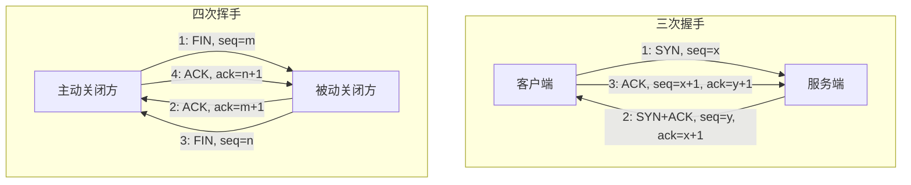

TCP 的三次握手和四次挥手是保证可靠连接建立和终止的核心机制。下面我将为你详细解释这两个过程。

为了更直观地展示整个过程，附上一张流程图：

### 🤝 TCP 三次握手：建立可靠连接

TCP 是面向连接的协议，在数据传输前必须通过“三次握手”建立连接。这个过程确保通信双方都具备发送和接收数据的能力，并同步初始序列号（Initial Sequence Number, ISN）。

#### 详细步骤

1.  **第一次握手 (SYN)**:
    *   **动作**：客户端发送一个 TCP 报文，其中 **SYN 标志位设为 1**，并随机生成一个初始序列号（seq = x）。客户端进入 `SYN_SENT` 状态。
    *   **含义**：客户端向服务器询问：“我想和你建立连接，这是我的初始序列号。”

2.  **第二次握手 (SYN-ACK)**:
    *   **动作**：服务器收到 SYN 报文后，若同意建立连接，则会回复一个报文。该报文同时设置 **SYN=1** 和 **ACK=1**。服务器也会随机生成自己的初始序列号（seq = y），并将**确认号（ack）** 设置为客户端的序列号加 1（ack = x + 1），表示期望收到下一个数据的序号。服务器进入 `SYN_RCVD` 状态。
    *   **含义**：服务器回应：“我收到你的请求了，我同意建立连接，这是我的初始序列号。”

3.  **第三次握手 (ACK)**:
    *   **动作**：客户端收到服务器的 SYN-ACK 报文后，会发送一个 **ACK=1** 的确认报文。其序列号为 seq = x + 1，确认号为 ack = y + 1（服务器序列号加 1）。客户端进入 `ESTABLISHED` 状态。服务器收到此 ACK 后，也进入 `ESTABLISHED` 状态。
    *   **含义**：客户端最后确认：“我收到你的回应了，连接正式建立。” 此后，双方可以开始传输数据。

#### 为何是三次？

*   **主要目的**：**防止已失效的连接请求报文突然传到服务器，导致资源浪费和错误连接**。假设一个客户端SYN请求因网络延迟滞留，在连接关闭后才到达服务器。若是两次握手，服务器会认为这是新的连接请求并直接进入连接状态，从而白白等待客户端数据，占用系统资源。三次握手机制下，客户端不会对这次迟到的服务器回应进行确认，服务器因收不到确认则会关闭连接。
*   **双向能力确认**：三次握手确保了双方都能确认自己的发送能力和对方的接收能力是正常的。

#### 关键字段与初始序列号（ISN）

| 字段 | 含义                                                                                             |
| :------------- | :------------------------------------------------------------------------------------------------------- |
| **`SYN`**        | Synchronize，同步标志位，用于发起连接。                                                                 |
| **`ACK`**        | Acknowledgment，确认标志位，表示确认收到对方的数据。                                                              |
| **`seq`**        | Sequence Number，序列号，标识本次发送的数据的起始位置。                                                              |
| **`ack`**        | Acknowledgment Number，确认号，**期望收到的下一段数据的起始序列号**，表示对此前所有数据的确认。                                |
| **ISN (Initial Sequence Number)** | 初始序列号，并非从0或1开始，而是基于时钟的动态随机值。这主要是为了安全，防止TCP会话被劫持，同时也能避免网络中延迟的旧数据包被错误地接收。 |

---

### 👋 TCP 四次挥手：优雅终止连接

TCP 连接是全双工的，意味着数据可以双向独立传输。因此，关闭连接需要每个方向都单独关闭。四次挥手过程就是用来安全、可靠地终止连接的。

#### 详细步骤

假设客户端主动发起关闭：

1.  **第一次挥手 (FIN)**:
    *   **动作**：客户端发送一个 **FIN=1** 的报文（FIN是Finish的缩写），序列号为 seq = m（m为当前已传送数据的最后一个字节的序列号加一）。客户端进入 `FIN_WAIT_1` 状态。
    *   **含义**：客户端告诉服务器：“我这边没有数据要发送了，准备关闭连接。”（但还可以接收数据）

2.  **第二次挥手 (ACK)**:
    *   **动作**：服务器收到 FIN 报文后，立即发送一个 **ACK=1** 的确认报文，确认号为 ack = m + 1。服务器进入 `CLOSE_WAIT` 状态。客户端收到此ACK后，进入 `FIN_WAIT_2` 状态。
    *   **含义**：服务器告诉客户端：“我收到你的关闭请求了。” 此时，从客户端到服务器的连接方向关闭。但服务器可能还有数据需要发送给客户端。

3.  **第三次挥手 (FIN)**:
    *   **动作**：当服务器也完成数据发送后，会发送一个 **FIN=1** 的报文，序列号为 seq = n（n为服务器当前已传送数据的最后一个字节的序列号加一）。服务器进入 `LAST_ACK` 状态。
    *   **含义**：服务器告诉客户端：“我这边数据也发送完了，我也要关闭连接了。”

4.  **第四次挥手 (ACK)**:
    *   **动作**：客户端收到服务器的 FIN 报文后，发送一个 **ACK=1** 的确认报文，确认号为 ack = n + 1。客户端随后进入 **`TIME_WAIT`** 状态。服务器收到这个ACK后，立即进入 `CLOSED` 状态，连接释放。客户端在 `TIME_WAIT` 状态等待 **2MSL**（Maximum Segment Lifetime，报文最大生存时间）后，也进入 `CLOSED` 状态。
    *   **含义**：客户端告诉服务器：“我收到你的关闭请求了，再见。”

#### 为何是四次？

*   因为 TCP 连接是**全双工**的，每个方向必须独立关闭。第二次和第三次挥手**不能合并**的原因在于：服务器收到客户端的FIN后，仅仅表示客户端不再发送数据，但服务器可能还有数据要发送给客户端。因此，服务器先发送ACK确认客户端的FIN，等自己数据发送完毕后再发送自己的FIN，这就导致了四次挥手。

#### `TIME_WAIT` 状态的作用

这是主动关闭的一方（通常是客户端）会经历的状态。等待 **2MSL** 时间有两个重要作用：
1.  **可靠地终止连接**：确保最后一个ACK报文能到达服务器。如果服务器没有收到第四次挥手的ACK，它会重传FIN报文。处于 `TIME_WAIT` 状态的客户端收到重传的FIN后，会重发ACK并重置2MSL计时器。
2.  **让旧报文消逝**：等待足够长的时间，使得本次连接中所有滞留在网络中的报文都失效，这样下一个新的连接就不会收到旧的、可能引起混淆的报文。

若服务器端出现大量 `CLOSE_WAIT` 状态，通常意味着应用程序没有正确调用 `close()` 来关闭 socket。

---

### 💡 常见问题与总结

| 特性 | 三次握手 | 四次挥手 |
| :--- | :--- | :--- |
| **目的** | 建立可靠连接 | 安全终止连接 |
| **次数** | 3次 | 4次 |
| **关键标志** | `SYN`, `ACK` | `FIN`, `ACK` |
| **能否携带数据** | 第三次握手可以 | 通常不携带（但理论上可，如延迟确认） |
| **必要性** | 防止失效连接请求、确认双方能力 | 全双工通信，双方独立关闭通道 |

**为什么连接是三次，而关闭是四次？**
核心在于 **SYN-ACK 可以合并，而 FIN-ACK 往往不能立即合并**。
*   **握手时**：服务器对客户端SYN的确认（ACK）和自身同步的SYN请求，**触发时机一致**（都由内核立即处理），因此可以合并为一个报文发送。
*   **挥手时**：服务器收到客户端的FIN后，内核会立即回复ACK。但服务器何时发送FIN，取决于**应用程序**何时调用 `close()` 来关闭连接，这可能导致时间差，因此ACK和FIN通常分开发送。

希望这些详细的解释能帮助你更好地理解 TCP 三次握手和四次挥手。这是理解网络通信的基础，也是很多高级概念和故障排查的出发点。
