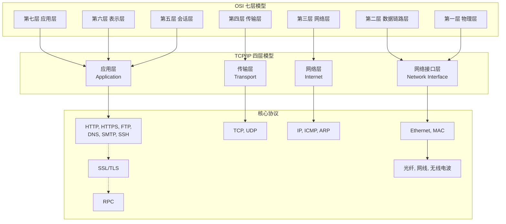

好的，我们来系统地梳理计算机网络中这两个至关重要的模型：**OSI 七层参考模型** 和 **TCP/IP 四层概念模型**，并详解各层对应的网络协议。

这两个模型是理解网络通信如何分层、协作的基石。OSI 模型是一个**理论框架**，用于理解和设计网络体系结构；而 TCP/IP 模型则是**现行互联网实际运行的协议栈**。

---

### 一、OSI 七层参考模型

OSI（Open Systems Interconnection）模型由国际标准化组织（ISO）提出，旨在使各种网络设备能够相互通信的标准框架。它分为七层，每一层都为其上层提供服务，并调用其下层提供的服务。

| 层级 | 名称 | 核心功能 | 关键词 | 常见协议/设备 |
| :--- | :--- | :--- | :--- | :--- |
| **7** | **应用层** (Application) | 为**应用程序**提供网络服务接口。负责用户与网络的交互。 | **HTTP**, FTP, SMTP, DNS | HTTP, HTTPS, FTP, SMTP, POP3, IMAP, DNS, SSH |
| **6** | **表示层** (Presentation) | **数据格式转换**。如加密/解密、压缩/解压缩、数据格式转换（如将机器特有的格式转换为标准格式）。 | **加密**, 压缩, 格式转换 | SSL/TLS（部分功能）, MPEG, JPEG |
| **5** | **会话层** (Session) | **建立、管理和终止**应用程序之间的会话（Session）或对话。 | **会话**, 验证, 重连 | NetBIOS, RPC, PPTP |
| **4** | **传输层** (Transport) | 提供**端到端**的可靠或不可靠的数据传输。负责**流量控制**和**差错控制**。 | **TCP**, UDP, 端口, 流量控制 | **TCP** (可靠), **UDP** (不可靠) |
| **3** | **网络层** (Network) | 进行**逻辑寻址**和**路由选择**。将数据包从源主机经过多个网络传输到目的主机。 | **IP**, 路由器, 寻址, 路由 | **IP** (IPv4/IPv6), **ICMP**, **OSPF**, BGP, **路由器** |
| **2** | **数据链路层** (Data Link) | 在**同一局域网**内，通过**物理地址（MAC地址）** 在两个直接相连的节点之间传输数据帧。负责**差错校验**。 | **MAC**, 交换机, 帧, 差错校验 | **Ethernet**, PPP, Switch, **网桥** |
| **1** | **物理层** (Physical) | 在物理介质上传输**原始比特流**。定义电气、机械、功能和规程特性。 | **比特流**, 网线, 光纤, 网卡, 集线器 | **RJ45**, 同轴电缆, 光纤, **中继器**, **集线器(Hub)** |

**记忆口诀：** All People Seem To Need Data Processing (应用、表示、会话、传输、网络、数据链路、物理)

---

### 二、TCP/IP 四层概念模型

TCP/IP 模型源于 ARPANET 和互联网的实践，是互联网实际使用的协议栈。它更侧重于**功能实现**而非严格分层，常被看作是 OSI 模型的简化版。

| 层级 | 名称 | 对应 OSI 层 | 核心功能 | 典型协议 |
| :--- | :--- | :--- | :--- | :--- |
| **4** | **应用层** (Application) | 应用层、表示层、会话层 | 将 OSI 的高三层功能合并，直接为应用进程提供通信服务。 | **HTTP**, **HTTPS**, **FTP**, **DNS**, **SMTP**, **POP3**, **IMAP**, **SSH**, RTP |
| **3** | **传输层** (Transport) | 传输层 | 与 OSI 传输层功能完全一致，提供端到端通信。 | **TCP** (面向连接、可靠), **UDP** (无连接、不可靠) |
| **2** | **网络层** (Internet) | 网络层 | 与 OSI 网络层功能一致，负责主机到主机的通信、IP寻址和路由。 | **IP** (IPv4/IPv6), **ICMP** (ping), **IGMP**, **ARP** (地址解析) |
| **1** | **网络接口层** (Network Interface) | 数据链路层、物理层 | 将 OSI 的最下面两层合并，负责在物理网络上发送和接收数据帧。 | **Ethernet**, Wi-Fi (802.11), PPP, MAC, 驱动程序 |

---

### 三、两个模型的对应关系与核心协议

下图清晰地展示了两大模型的对应关系及每一层承载的核心协议：

---

### 四、数据封装与解封装过程

数据在网络中传输时，会经历一个“打包”和“拆包”的过程，这完美体现了分层模型的价值。

**发送端（封装 - Encapsulation）：自上而下，添加头部（和尾部）**
1.  **应用层：** 用户产生原始数据（Data）。
2.  **传输层：** 将数据分段，并加上 **TCP 头部**（包含源端口、目的端口等），形成**报文段（Segment）**（或 UDP 数据报）。
3.  **网络层：** 加上 **IP 头部**（包含源IP、目的IP等），形成**数据包（Packet）**。
4.  **数据链路层：** 加上 **以太网头部**（包含源MAC、目的MAC等）和**尾部（用于差错校验）**，形成**帧（Frame）**。
5.  **物理层：** 将帧转换为**比特流**，通过物理介质（如网线）发送出去。

**接收端（解封装 - Decapsulation）：自下而上，移除头部**
1.  **物理层：** 接收比特流，将其重组为帧。
2.  **数据链路层：** 查看 MAC 地址，如果匹配则移除头部和尾部，将数据包向上传递给网络层。
3.  **网络层：** 查看 IP 地址，如果匹配则移除 IP 头部，将报文段向上传递给传输层。
4.  **传输层：** 查看端口号，移除 TCP/UDP 头部，将数据向上传递给正确的应用程序。
5.  **应用层：** 将原始数据呈现给用户。

---

### 五、总结与对比

| 特性 | OSI 七层模型 | TCP/IP 四层模型 |
| :--- | :--- | :--- |
| **本质** | **理论模型**，由ISO提出，用于网络设计的**概念性框架**和**教学工具**。 | **实践模型**，源于ARPANET，是互联网**实际运行**的协议栈。 |
| **层级** | 七层，划分更精细，功能更明确。 | 四层，更紧凑，更侧重于功能实现而非严格分层。 |
| **关系** | 先有模型，后有协议。 | 先有协议，后抽象出模型。 |
| **适用性** | 通用性更强，适合解释各种网络概念。 | 实用性强，完全围绕互联网协议族设计。 |
| **核心协议** | 不绑定特定协议，只是一个框架。 | 与IP、TCP、UDP、HTTP等协议紧密绑定。 |

**核心要点：**
*   **OSI 模型**帮助我们理解和 troubleshoot 网络问题。例如，ping 不通是网络层（IP/ICMP）问题，网页打不开但能 ping 通可能是应用层（HTTP）或传输层（TCP端口）问题。
*   **TCP/IP 模型**是我们每天使用的互联网的基石。我们编写的网络应用程序（如HTTP服务器、客户端）就工作在它的应用层和传输层。
*   理解**数据封装流程**是理解网络通信如何工作的关键。
*   **IP 地址**（网络层）负责将数据包送到目标**主机**，**端口号**（传输层）负责将数据交给主机上的目标**应用程序**，**MAC 地址**（数据链路层）负责将数据帧传递给**下一个设备**（如路由器或交换机）。
