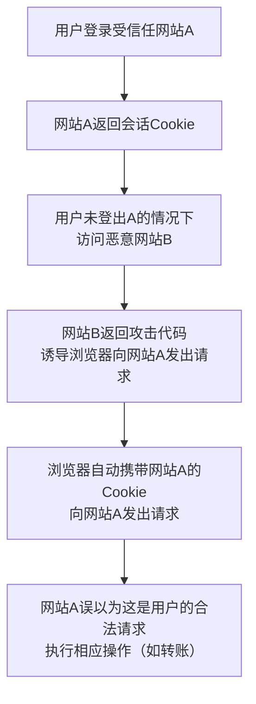

CSRF（跨站请求伪造）是一种常见的网络安全威胁，攻击者会利用用户在某网站已登录的会话来执行非授权的操作。下面我来为你解释一下CSRF的攻击原理、常见场景以及如何有效防御。

### 🔍 CSRF攻击原理与过程

CSRF（Cross-Site Request Forgery，跨站请求伪造）攻击的核心在于**利用网站对用户浏览器的信任**。攻击者会诱导受害者在不知情的情况下，以他们的身份向目标网站发送恶意请求。

一个典型的CSRF攻击需要满足几个条件：
*   **用户已登录目标网站**（如银行、社交平台），并且会话（Cookie）仍未失效。
*   **目标网站未采取有效的CSRF防护措施**，仅凭会话Cookie等凭证就执行敏感操作。
*   **用户被诱骗访问了攻击者精心构造的页面**，该页面会自动向目标网站发送恶意请求。

其攻击过程可以简要概括为以下几步：

### 🎯 常见CSRF攻击场景与类型

攻击者会利用各种方式发起CSRF攻击，以下是几种常见的场景和类型：

| **攻击场景** | **描述** | **示例** |
| :--- | :--- | :--- |
| **论坛/博客诱导点击** | 在恶意帖子或博客中嵌入隐藏请求 | 隐藏的 `` 标签发起转账请求 |
| **钓鱼邮件中的链接** | 邮件中包含诱导用户点击的CSRF链接 | 修改用户邮箱地址的链接 |
| **恶意广告** | 在广告中嵌入CSRF代码，自动触发 | 利用 iframe 或 img 标签加载恶意URL |
| **自动提交表单** | 页面隐藏表单并通过JS自动提交 | 自动提交修改密码或信息的POST表单 |
| **移动端H5页面** | 通过WebView注入伪装链接 | 在App内WebView中触发敏感操作 |
| **电商网站操作** | 诱导用户点击链接执行操作 | 自动将商品加入购物车或下单 |
| **智能设备后台** | 针对局域网内设备管理界面 | 重启路由器、修改摄像头设置 |

CSRF攻击根据请求方式和手法的不同，主要分为以下几种类型：

1.  **基于GET请求的CSRF**：通常利用 ``、`<iframe>` 等标签的 `src` 属性，或恶意链接，诱导用户点击或自动加载，从而发起GET请求。由于GET请求本不应用于数据修改，因此这类攻击也反映出网站设计上的缺陷。
2.  **基于POST请求的CSRF**：攻击者构造一个隐藏的表单，通过JavaScript自动提交，向目标网站发起POST请求。这种攻击能执行更复杂的操作。
3.  **登录CSRF**：诱使用户在不知情的情况下，使用攻击者的凭证登录网站。这样用户后续的操作可能会在攻击者的账户下进行，导致信息混淆或为其他攻击创造条件。
4.  **存储型CSRF（结合XSS）**：如果网站同时存在XSS漏洞，攻击者可以将CSRF攻击代码持久化地存储在目标网站中，所有访问该页面的用户都可能受到影响，危害更大。

### 🛡️ CSRF防御措施

防御CSRF需要结合多种策略，以下是一些有效且常见的措施：

| **防御措施** | **原理描述** | **特点与注意事项** |
| :--- | :--- | :--- |
| **CSRF Token** | 服务器为每个会话生成唯一、不可预测的Token，要求客户端在请求（如表单或AJAX）中携带并在服务器端验证。 | **最有效和推荐的方法**。Token需保证随机性、保密性（防止被XSS窃取），并且不要通过Cookie发送。 |
| **SameSite Cookie属性** | 设置Cookie的SameSite属性为 `Strict` 或 `Lax`，限制第三方网站在跨站请求中发送Cookie。 | `Strict`: 完全禁止跨站发送Cookie，安全性最高。 `Lax` (默认): 允许部分安全跨站请求（如导航链接的GET请求）。 这是一种浏览器端防护，无需修改大量应用代码。 |
| **验证请求来源** | 服务器检查HTTP请求头中的 `Origin` 或 `Referer` 字段，判断请求是否来自同源或可信的域名。 | `Origin` 适用于POST和CORS请求；`Referer` 信息更全但可能被浏览器隐私设置禁用或缺失，需处理头信息缺失情况。 |
| **重要操作二次验证** | 对敏感操作（如转账、改密）要求用户进行二次确认，例如输入验证码、短信验证、密码再次确认等。 | **能彻底阻断CSRF**，但会增加用户操作步骤，需权衡安全性与用户体验，通常用于关键操作。 |
| **避免敏感操作使用GET** | **严格遵循HTTP规范**，GET请求只用于获取数据，不用于任何会产生副作用的操作。所有修改数据的操作都应使用POST、PUT、DELETE等方法。 | 良好的设计习惯，能从设计上减少部分CSRF风险（如基于GET的简单攻击）。 |

在实际应用中，**组合使用多种防御措施**（例如 **CSRF Token + SameSite Cookie**）能提供更坚固的防护。

### 💎 总结

CSRF是一种利用网站对用户浏览器信任的攻击方式，攻击者可在用户不知情的情况下以其身份执行非授权操作。防范CSRF的关键在于**打破“请求自动携带凭证”这一环节**，或者**让攻击者无法伪造出合法的请求**。

有效的防御需要从设计（如避免用GET进行敏感操作）、技术（如使用CSRF Token、SameSite Cookie）和管理（如敏感操作二次验证）等多方面综合考虑，建立纵深防御体系。

希望以上信息能帮助你更好地理解CSRF攻击。网络安全需要持续关注和实践，如果你对特定场景的防御或更深入的技术细节有更多疑问，我很乐意继续探讨。
