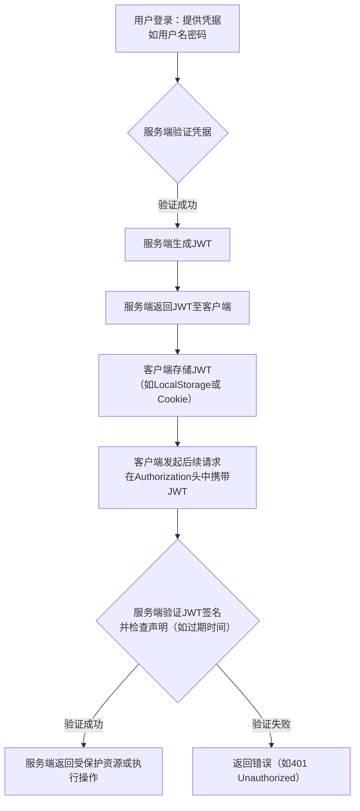

JWT（JSON Web Token）是一种开放标准（RFC 7519），用于在网络应用间安全传递信息。它以一种紧凑且自包含的方式，作为 JSON 对象在各方之间安全地传输信息。这些信息是经过数字签名的，因此可以被验证和信任。

下面是一个快速了解 JWT 核心特点和过程的表格，然后我会为你进一步解释。

| 方面                 | JWT 的简要说明                                                                                              |
| :------------------- | :--------------------------------------------------------------------------------------------------------- |
| **核心目标**         | 安全身份认证与授权                                                                        |
| **关键特征**         | 紧凑、自包含、可签名（通常使用 HMAC 或 RSA）                                 |
| **主要结构**         | Header (头部)、Payload (载荷)、Signature (签名)                                      |
| **主要优点**         | 无状态、支持跨域、移动端友好                                                  |
| **主要缺点**         | 令牌一旦签发，在到期前无法主动废止；若保护不当，令牌泄露可能带来风险                                 |
| **典型工作流程**     | 1. 用户登录 → 2. 服务端生成并返回 JWT → 3. 客户端在请求中携带 JWT → 4. 服务端验证 JWT 并授权             |
| **常见存储位置**     | 客户端本地存储 (Local Storage)、会话存储 (Session Storage) 或 Cookie                                      |
| **传输方式**         | 通常在 HTTP 请求头 `Authorization: Bearer <token>` 中                                          |

### 📝 JWT 的组成

一个 JWT Token 实际上是一个字符串，它由三部分组成，用点（.）分隔：**Header**、**Payload**、**Signature**，形式为 `xxxxx.yyyyy.zzzzz`。

*   **Header (头部)**：通常包含两部分信息：
    *   `typ`：令牌类型，就是 `JWT`。
    *   `alg`：签名算法，如 HMAC SHA256（写作 HS256）或 RSA 等。头部会经过 Base64Url 编码。
*   **Payload (载荷)**：包含您需要传递的“声明”（claims），即关于实体（通常是用户）和其他元数据的陈述。声明分为三种类型：
    *   **注册声明**：预定义的一些声明，如 `iss`（签发者）、`exp`（过期时间）、`sub`（主题）、`aud`（受众）等。
    *   **公共声明**：可以自定义的声明，但为避免冲突，最好使用已定义或通过命名空间定义的名称。
    *   **私有声明**：双方共享数据使用的私有名字。**注意：Payload 默认只是 Base64Url 编码，并非加密，所以不要存放密码等敏感信息。**
*   **Signature (签名)**：这是最关键的部分，用于验证令牌是否被篡改。签名通过将编码后的 Header、编码后的 Payload、一个密钥（secret）以及 Header 中指定的算法生成。例如，使用 HMAC SHA256 算法时，签名这样生成：
    `HMACSHA256( base64UrlEncode(header) + "." + base64UrlEncode(payload), secret)`

### 🔄 JWT 的工作流程

JWT 通常用于身份认证，其基本工作流程如下：

### ⚖️ JWT 的优缺点

**优点：**
*   **无状态/可扩展**：服务端不需要存储会话信息（Session），Token 自身包含所有必要信息，易于分布式系统和水平扩展。
*   **跨域和跨语言支持**：基于 JSON 格式，易于处理，非常适合跨域场景（CORS）和单点登录（SSO）。
*   **移动端友好**：Token 可以轻松存储在移动设备上，不像 Cookie 那样依赖浏览器环境。
*   **灵活性**：Payload 可以包含自定义声明，传递用户角色、权限等信息。

**缺点：**
*   **令牌无法主动失效**：一旦签发，在有效期内会一直有效，除非服务端部署额外的逻辑（如使用令牌黑名单）。
*   **安全性依赖存储和传输**：Token 如果泄露，他人可能盗用。需使用 HTTPS 传输，并谨慎选择客户端存储方式（防范 XSS 攻击）。
*   **令牌体积**：如果包含大量信息，可能比 Session ID 大，增加网络开销。

### 🔐 安全实践

使用 JWT 时，请注意：
*   **保护密钥**：签名密钥（secret）或私钥必须严格保密在服务端。
*   **使用 HTTPS**：始终通过 HTTPS 传输 JWT，防止中间人攻击和令牌泄露。
*   **设置合理的有效期**：为 JWT 设置较短的有效期（`exp` claim），减少泄露后的风险窗口。
*   **避免存储敏感信息**：Payload 默认未加密，不要存放密码、个人身份信息等敏感数据。
*   **选择安全的客户端存储**：权衡 LocalStorage（易受 XSS 攻击）和 HttpOnly Cookie（易受 CSRF 攻击）的利弊，并采取相应防护措施。

JWT 在现代 Web 开发和微服务架构中非常常见，理解其原理和最佳实践对于构建安全的应用程序至关重要。

希望这些信息能帮助你更好地理解 JWT。如果你对 JWT 的特定应用场景或技术细节有更多疑问，我很乐意继续探讨。
