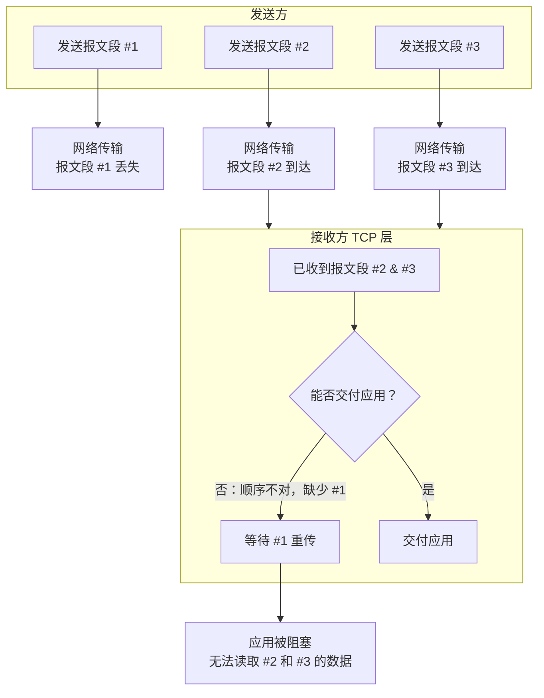

好的，我们来深入探讨 **TCP 和 HTTP 的队头阻塞（Head-of-Line Blocking, HOLB）** 问题。这是一个理解网络性能瓶颈的关键概念。

### 一、什么是队头阻塞？

**核心思想**：在一个要求**按顺序**处理任务的队列中，如果排在**第一个**的任务处理缓慢或被阻塞，那么即使后面的任务已经准备好，也必须等待第一个任务完成。这会拖慢整个队列的进度。

**生活比喻**：
你在超市只有一个收银台的结账队伍中。队伍的第一个人正在用硬币慢慢数钱付款，这个过程非常慢。即使你只是买一瓶水，已经拿出了钞票，你也必须等待前面所有的人完成付款。这个慢速的顾客就造成了“队头阻塞”。

---

### 二、TCP 队头阻塞

TCP 是一个**可靠**的、**按序**交付的协议。它保证接收方应用程序读到的数据字节流，顺序与发送方发送的完全一致。

*   **产生原因**：
    1.  发送方将应用层数据分割成多个 **TCP 报文段**发送。
    2.  这些报文段在网络中传输时可能**丢失**、**乱序**或**延迟**。
    3.  接收方的 TCP 层负责将收到的报文段**按序号重新排序**，组装成完整的数据流后，才交付给应用层。

*   **问题场景**：
    假设发送方发送了 3 个报文段，序号分别是 `1`, `2`, `3`。
    *   报文段 `1` 在网络中丢失了。
    *   报文段 `2` 和 `3` 已经正确地、提前到达了接收方。
    *   然而，接收方的 TCP 层**不能**将 `2` 和 `3` 直接交给应用程序！因为它必须保证数据顺序。
    *   接收方会一直发送 `ACK=1`（确认收到 `1`，实际上没收到），要求发送方重传报文段 `1`。
    *   发送方收到重复的 `ACK` 后，触发重传机制，重新发送报文段 `1`。
    *   在此期间，应用程序**无法读取**已经到达的 `2` 和 `3` 的数据，必须等待 `1` 成功到达并组装完毕。

*   **本质**：
    **TCP 层的队头阻塞是由于 TCP 的可靠性（重传机制）和按序交付保证导致的。** 一个报文段的丢失会阻塞其后所有已到达的报文段的数据交付，即使这些数据本身完好无损。

**图示说明：**

---

### 三、HTTP 队头阻塞

HTTP 队头阻塞发生在**应用层**，具体表现与使用的 HTTP 版本密切相关。

#### 1. HTTP/1.1 的队头阻塞

*   **产生原因**：HTTP/1.1 默认使用**持久连接**，允许在同一个 TCP 连接上发送多个请求。然而，这些请求必须是**串行**的。
*   **问题场景**：
    *   浏览器打开一个 TCP 连接到服务器。
    *   通过这个连接，先后发送请求 A（获取一个大型图片）和请求 B（获取一个小的 CSS 文件）。
    *   服务器按顺序处理，先响应 A，再响应 B。
    *   如果请求 A 的处理很慢（或者它的响应数据很大，传输慢），那么请求 B 的响应就必须**在队列中等待**，直到请求 A 的响应全部发送完毕。
    *   即使请求 B 的资源很小，可以很快返回，也无法“超车”。
*   **“解决方案”（并不完美）**：
    *   **并发 TCP 连接**：浏览器为同一个域名建立多个 TCP 连接（通常 6-8 个），将请求分散到不同的连接上，绕过单个连接上的队头阻塞。但这违反了 HTTP/1.1 设计持久连接的初衷，增加了服务器和网络的负担。
    *   **域名分片**：将资源放在不同的子域名下，从而突破浏览器的每域名连接数限制。这是一种 Hack，会增加 DNS 查询开销。

#### 2. HTTP/2 的队头阻塞

HTTP/2 通过**多路复用**解决了 **HTTP 层的队头阻塞**。

*   **解决方案**：
    *   HTTP/2 引入了**帧（Frame）**、**流（Stream）** 的概念。
    *   多个 HTTP 请求和响应可以在**一个 TCP 连接**上**交错**地进行（多路复用）。
    *   每个请求/响应被分配一个唯一的**流 ID**，接收方根据 ID 重新组装。
    *   这意味着：**慢请求的响应不会阻塞其他请求的响应**。请求 B 的帧可以和请求 A 的帧混杂在一起传输，浏览器收到后能优先处理并渲染请求 B 的资源。

*   **遗留问题**：
    HTTP/2 只是解决了**应用层（HTTP）的队头阻塞**，但它的多路复用是建立在**单 TCP 连接**之上的。因此，**TCP 层的队头阻塞**问题依然存在！
    *   如果某个 TCP 报文段（可能包含了多个不同 HTTP 流的帧）丢失，整个 TCP 连接就会陷入我们上面描述的 TCP HOLB 状态。
    *   所有 HTTP 流（即使它们的数据包已经到达）都必须等待丢失的那个包重传成功。
    *   **这导致了一个悖论：HTTP/2 的单一高效连接，反而让它在丢包网络环境下比 HTTP/1.1 的多个连接更脆弱。** 因为 HTTP/1.1 的多个连接中，只有一个连接会受 HOLB 影响，其他连接不受影响。

#### 3. HTTP/3 的终极解决方案

HTTP/3 彻底解决了 TCP 和 HTTP 的队头阻塞问题。

*   **解决方案**：
    *   **弃用 TCP**，改用基于 UDP 的 **QUIC** 协议。
    *   QUIC 在**传输层**原生实现了**多路复用**。每个独立的“流”都在 QUIC 层面进行了抽象。
    *   **关键特性**：QUIC 为每个流提供**独立的、可靠的**数据交付保证。如果一个流的数据包丢失，**只会影响该流本身**。其他流的数据包即使乱序到达，也能被及时处理并交付给应用层。
    *   HTTP/3 将帧和流的概念映射到 QUIC 的流上。

*   **结果**：
    *   在 HTTP/3 中，无论是应用层还是传输层，都不存在队头阻塞问题。
    *   数据包丢失只会导致某个特定资源的加载变慢，而不会阻塞连接中所有其他资源的加载。

---

### 四、总结对比

| 协议 | 层 | 队头阻塞问题 | 原因与解决方案 |
| :--- | :--- | :--- | :--- |
| **HTTP/1.1** | **应用层** | **存在** | 请求在单个连接上必须串行处理。**解决方案**：开启多个 TCP 连接。 |
| **HTTP/2** | **应用层** | **已解决** | 通过多路复用，请求和响应帧可以交错传输。 |
| | **传输层 (TCP)** | **仍然存在** | 底层 TCP 协议的特性导致。一个包丢失会阻塞整个连接。 |
| **HTTP/3 (QUIC)** | **应用层** | **已解决** | 继承 HTTP/2 的多路复用优势。 |
| | **传输层** | **已解决** | 基于 UDP，QUIC 为每个流提供独立可靠性保证，丢失只影响单个流。 |

**核心结论：**
*   **HTTP/1.1 的 HOLB** 是应用层协议设计导致的。
*   **HTTP/2 的 HOLB** 是其底层传输协议 TCP 固有的特性导致的。
*   **HTTP/3** 通过改变底层传输协议，从根源上解决了所有层面的队头阻塞问题，特别适合高丢包、高延迟的移动网络环境。
